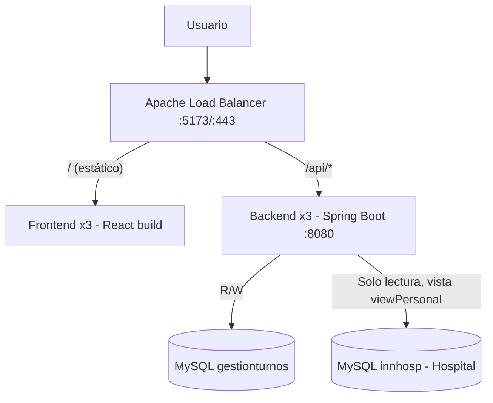
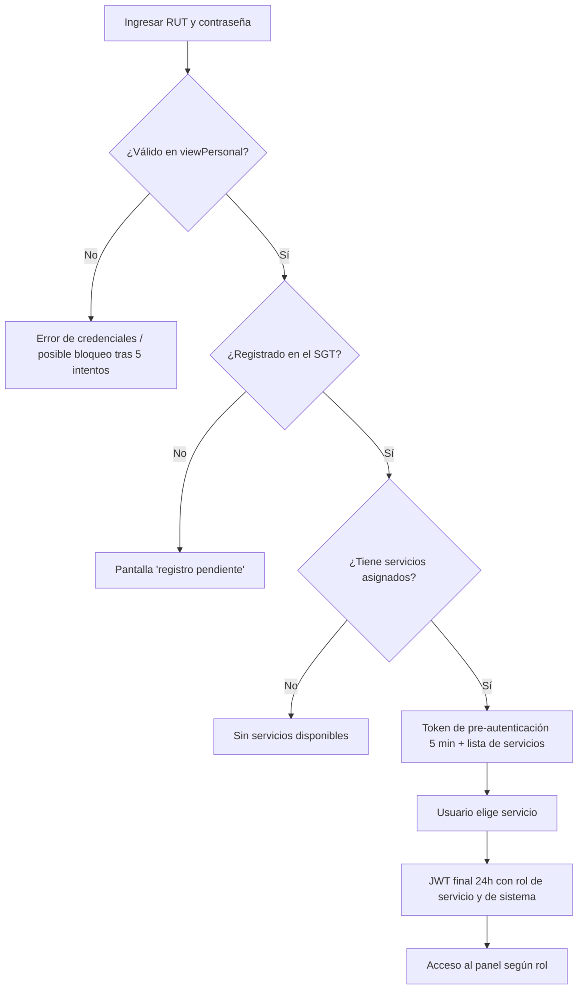
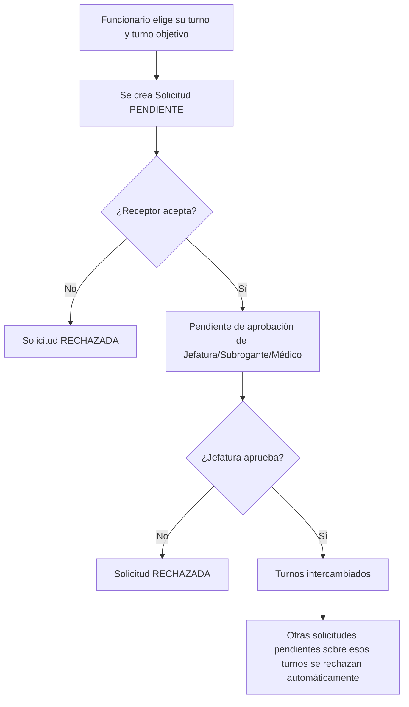
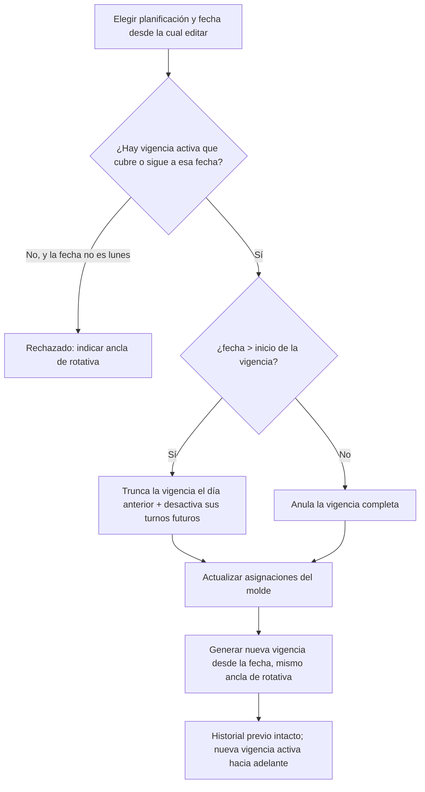

# Archivo de funcionalidades del sistema SGT

> Documento generado mediante análisis funcional del código fuente real del repositorio (backend Spring Boot, frontend React, esquemas SQL, configuración de despliegue y documentación técnica/QA/seguridad ya existente en `docs/`). No se modificó código, configuración ni datos durante este análisis. Toda afirmación relevante incluye su evidencia (archivo, componente, endpoint o tabla). Donde no fue posible confirmar un comportamiento se indica explícitamente como no verificado.

**Fecha de análisis:** 2026-08-03
**Repositorio analizado:** `Sprint3/` (raíz del proyecto, dentro de `c:\turno2.0\Sprint3`)

---

## Tabla de contenido

1. [Información general](#1-información-general)
2. [Resumen ejecutivo](#2-resumen-ejecutivo)
3. [Arquitectura funcional general](#3-arquitectura-funcional-general)
4. [Perfiles, roles y permisos](#4-perfiles-roles-y-permisos)
5. [Mapa general de módulos](#5-mapa-general-de-módulos)
6. [Descripción detallada de módulos](#6-descripción-detallada-de-módulos)
7. [Gestión de usuarios](#7-gestión-de-usuarios)
8. [Gestión de funcionarios](#8-gestión-de-funcionarios)
9. [Gestión de unidades, servicios o departamentos](#9-gestión-de-unidades-servicios-o-departamentos)
10. [Gestión y planificación de turnos](#10-gestión-y-planificación-de-turnos)
11. [Calendarios y visualización](#11-calendarios-y-visualización)
12. [Reportes y exportaciones](#12-reportes-y-exportaciones)
13. [Notificaciones y alertas](#13-notificaciones-y-alertas)
14. [Auditoría y trazabilidad](#14-auditoría-y-trazabilidad)
15. [Integraciones](#15-integraciones)
16. [Modelo funcional de datos](#16-modelo-funcional-de-datos)
17. [Validaciones generales](#17-validaciones-generales)
18. [Reglas de negocio consolidadas](#18-reglas-de-negocio-consolidadas)
19. [Flujos funcionales principales](#19-flujos-funcionales-principales)
20. [Matriz de funcionalidades](#20-matriz-de-funcionalidades)
21. [Funcionalidades incompletas o pendientes](#21-funcionalidades-incompletas-o-pendientes)
22. [Funcionalidades aparentemente obsoletas](#22-funcionalidades-aparentemente-obsoletas)
23. [Riesgos y observaciones funcionales](#23-riesgos-y-observaciones-funcionales)
24. [Glosario](#24-glosario)
25. [Conclusiones](#25-conclusiones)

---

## 1. Información general

| Campo | Detalle |
|---|---|
| **Nombre del sistema** | Sistema de Gestión de Turnos |
| **Nombre abreviado** | SGT (también referido como SGT-HUAP) |
| **Institución** | Hospital de Urgencia Asistencia Pública (HUAP) |
| **Objetivo** | Planificar, asignar y gestionar los turnos del personal clínico y administrativo del hospital, por servicio y puesto, con solicitudes de cambio de turno, notificaciones, bitácora de auditoría y estadísticas, bajo autenticación y autorización por rol. |
| **Problema que resuelve** | Reemplazar la gestión manual/artesanal de turnos hospitalarios (planillas, papel, coordinación informal) por una plataforma centralizada que permite generar turnos a partir de plantillas repetibles ("rotativas"), detectar automáticamente conflictos de horario, y canalizar de forma trazable los cambios de turno (permisos, intercambios, coberturas, ofertas) que normalmente ocurren de manera informal entre funcionarios. |
| **Usuarios principales** | Administrador del sistema, Jefatura de servicio, Subrogante (suplente de jefatura), Funcionario/Médico (usuario de base) |
| **Áreas involucradas** | Servicios clínicos del hospital (ej. Medicina Interna, Enfermería, Cirugía, Urgencias — según datos de ejemplo del propio repositorio) |
| **Alcance funcional** | Autenticación e identidad, estructura organizacional (servicios/puestos/jerarquía), catálogo de turnos y rotativas, planificación y generación automática de turnos, gestión manual de turnos, solicitudes de cambio de turno, ofertas generales de turno, notificaciones internas, bitácora de auditoría, feriados, reglas de ajuste horario, exportación de reportes CSV |
| **Arquitectura general** | Frontend SPA (React) + Backend API REST (Spring Boot) + dos bases de datos MySQL (propia y del hospital) detrás de un balanceador Apache, todo contenedorizado con Docker Compose |
| **Tecnologías principales** | Backend: Java 21, Spring Boot 4.0.0-SNAPSHOT, Spring Data JPA, Spring Security + JWT, MySQL 8.0, Maven. Frontend: React 19, Vite 7, React Router 7 (instalado pero no usado como enrutador real — ver [sección 21](#21-funcionalidades-incompletas-o-pendientes)), Tailwind 3, Axios, dayjs. Infraestructura: Docker Compose, Apache httpd 2.4 (balanceador de carga) |
| **Forma de acceso** | Aplicación web, autenticación mediante RUT y contraseña validados contra la base de datos de personal del hospital |
| **Componentes principales** | `huap_backend/` (API REST), `sgt-huap_frontend/` (SPA), `BaseDatosMySQL/` (esquemas SQL de las dos bases de datos), `apache/`/`nginx/` (configuración de balanceo/proxy), `docs/` (documentación técnica, QA y seguridad ya elaborada por el equipo) |
| **Estado general observado** | Funcionalmente completo respecto de los flujos centrales (turnos, planificación, solicitudes, ofertas, notificaciones, bitácora); existen brechas de autorización a nivel de lectura y discrepancias entre lo documentado en manuales de usuario y lo realmente implementado, ya identificadas y registradas por el propio equipo en `docs/qa/` y `docs/security/` (ver secciones 21 y 23) |

**Evidencia:** `README.md` (raíz), `huap_backend/pom.xml`, `sgt-huap_frontend/package.json`, `docker-compose.yml`.

---

## 2. Resumen ejecutivo

El SGT es una plataforma web de gestión de turnos para personal hospitalario. Permite a un **Administrador** configurar la estructura completa del sistema (servicios, tipos de turno, rotativas/plantillas cíclicas, planificaciones), a las **Jefaturas** y **Subrogantes** administrar la operación diaria de su servicio (asignación de turnos, aprobación de solicitudes, gestión de puestos y reglas de horario), y a los **Funcionarios/Médicos** consultar su agenda, solicitar cambios de turno (permiso, ceder turno, cobertura, intercambio) y postularse a turnos ofrecidos por otros compañeros.

**Módulos principales identificados:**
- Autenticación y sesión (login en dos pasos + selección de servicio)
- Estructura organizacional (Servicios, Puestos, Jerarquía de funcionarios)
- Catálogo de turnos (Tipos de Turno, Rotativas/plantillas cíclicas, Reglas de horario, Feriados)
- Planificación y generación automática de turnos
- Gestión manual de turnos (asignar/reasignar/desasignar/cambiar horas) y calendario
- Solicitudes de cambio de turno (Permiso, Botar turno, Cobertura, Intercambio, Oferta particular)
- Ofertas generales de turno y postulaciones
- Notificaciones internas
- Bitácora de auditoría
- Exportación de reportes en CSV
- Paneles/dashboards diferenciados por rol (Admin, Jefatura, Subrogante, Funcionario)

**Cómo se utiliza:** el usuario ingresa RUT y contraseña (validados contra la base de datos de personal del hospital, `innhosp`), elige el servicio en el que desea operar (un mismo funcionario puede pertenecer a varios servicios con distintos roles), y accede a una interfaz de una sola página que cambia de vista internamente según el rol activo, sin recarga de página.

**Capacidades más importantes:**
- Generación automática de turnos reales a partir de una "rotativa" (patrón cíclico) aplicada sobre un rango de fechas, con detección de conflictos de horario y ajuste automático por fines de semana/feriados.
- Flujo completo de solicitudes con aprobación de jefatura, incluyendo rechazo automático de solicitudes competidoras sobre el mismo turno.
- Bitácora exhaustiva de todos los cambios relevantes (asignaciones manuales, generación de turnos, resolución de solicitudes, ofertas).
- Control de concurrencia mediante bloqueos pesimistas para evitar dobles asignaciones o aprobaciones simultáneas conflictivas.

**Funcionalidades completas:** la práctica totalidad de los flujos de negocio (turnos, solicitudes, ofertas, planificación, bitácora, notificaciones internas) tiene una cadena interfaz → API → persistencia funcionando de extremo a extremo, según lo confirmado tanto por la lectura de código como por las pruebas funcionales ya documentadas por el equipo en `docs/qa/API_FUNCTIONAL_TEST_RESULTS.md`.

**Aspectos incompletos o que requieren validación:**
- Existen endpoints de lectura (GET) sin restricción de rol/servicio más allá de "usuario autenticado", lo que el propio equipo documentó como defectos de autorización (BUG-002 a BUG-007 en `docs/qa/DEFECT_REGISTER.md`).
- El frontend no usa enrutamiento real (todas las rutas de React Router apuntan al mismo componente); la navegación es una máquina de estados interna.
- Hay código muerto o huérfano relevante: un módulo de notificaciones en tiempo real vía WebSocket no conectado (`utils/socket.js`), un motor de generación de turnos 100% cliente no utilizado (`utils/PlantillaEngine.js`), archivos vacíos (`utils/coverage.js`, `components/Jefatura/JefaturaStatsView.jsx`), y un controlador de tipos de solicitud sin endpoints (`TipoSolicitudController`).
- No hay envío de correo electrónico pese a que la dependencia está declarada (`spring-boot-starter-mail`).
- No hay ambiente HTTPS/TLS configurado (bloqueante documentado por el propio equipo para exposición a Internet).

---

## 3. Arquitectura funcional general

### Frontend
Aplicación de una sola página (SPA) construida en **React 19 + Vite 7**. A pesar de tener `react-router-dom` instalado, la navegación real ocurre mediante un componente central (`components/Admin2/Prop4.jsx`) que mantiene un estado `currentView` y renderiza condicionalmente decenas de vistas (dashboards por rol, calendario, solicitudes, administración). El estado de sesión (token JWT y datos de usuario) se guarda en `localStorage` y se gestiona mediante un contexto de React (`AuthContext`). Las notificaciones se refrescan por sondeo periódico (polling cada 15 segundos), no en tiempo real.

**Evidencia:** `sgt-huap_frontend/src/App.jsx`, `sgt-huap_frontend/src/components/Admin2/Prop4.jsx`, `sgt-huap_frontend/src/context/AuthContext.jsx`, `sgt-huap_frontend/src/context/NotificationContext.jsx`.

### Backend
API REST construida en **Spring Boot 4.0.0-SNAPSHOT** (Java 21), organizada en capas clásicas Controller → Service → Repository → Entity (JPA/Hibernate), bajo el paquete `com.pingeso.HUAP`. Expone endpoints bajo el prefijo `/api/v2`. Utiliza **Spring Security** con autenticación **JWT stateless** (sin sesiones de servidor) y control de acceso por rol mediante reglas declarativas en `SecurityConfig` (por prefijo de ruta + método HTTP) complementadas puntualmente con anotaciones `@PreAuthorize` en algunos controladores.

**Evidencia:** `huap_backend/src/main/java/com/pingeso/HUAP/Controller/*.java`, `huap_backend/src/main/java/com/pingeso/HUAP/Config/SecurityConfig.java`.

### Base de datos
El backend mantiene **dos conexiones JDBC independientes**, sin relación por clave foránea entre ellas:
- **`gestionturnos`** — base de datos propia del SGT, lectura/escritura, contiene toda la lógica de negocio (servicios, turnos, planificaciones, solicitudes, bitácora, etc.).
- **`innhosp` (vista `viewPersonal`)** — base de datos del hospital, **solo lectura**, usada exclusivamente para validar credenciales de login y para dar de alta personal nuevo en el SGT. El SGT nunca escribe en esta base (`hibernate.hbm2ddl.auto=none` fijo para este datasource).

**Evidencia:** `huap_backend/src/main/resources/application.properties`, `huap_backend/src/main/java/com/pingeso/HUAP/Config/HospitalDataSourceConfig.java`, `huap_backend/src/main/java/com/pingeso/HUAP/Config/PrimaryDataSourceConfig.java`, `BaseDatosMySQL/despliegue/schema_gestionturnos.sql`, `BaseDatosMySQL/despliegue/setup_innhosp.sql`.

### Servicios externos
No se encontraron integraciones con pasarelas de pago, proveedores OAuth externos, ni servicios de correo activos. La única integración externa real es la base de datos de personal del hospital (`innhosp`), tratada como un sistema fuera del control del SGT. La dependencia `spring-boot-starter-mail` está declarada en `pom.xml` pero no se encontró configuración SMTP ni código que la utilice — **no existe envío de correo funcional** (ver [sección 21](#21-funcionalidades-incompletas-o-pendientes)).

**Evidencia:** `huap_backend/pom.xml`, `docs/security/SECURITY_ARCHITECTURE.md`.

### Mecanismo de autenticación
Login en **dos pasos**: (1) validación de RUT+contraseña contra `viewPersonal` del hospital, que emite un **token de pre-autenticación** de 5 minutos y la lista de servicios donde el usuario puede operar; (2) selección de servicio, que emite el **JWT final** (24 horas) con claims de rol de servicio (`JEFATURA`/`SUBROGANTE`/`MEDICO`), rol de sistema (`ADMINISTRADOR`/`USUARIO`) y servicio activo. El backend soporta contraseñas heredadas del hospital (SHA-512 sin sal) y contraseñas nuevas (BCrypt) mediante un `DelegatingPasswordEncoder`.

**Evidencia:** `Controller/FuncionarioController.java`, `Service/FuncionarioService.java`, `Security/JwtTokenProvider.java`, `Security/JwtAuthenticationFilter.java`.

### Comunicación entre componentes
El frontend consume la API mediante `axios` con una URL base configurable (`VITE_API_BASE_URL`, por defecto `/api/v2`) e interceptores que adjuntan el JWT y gestionan expiración/errores 401. No se encontró comunicación en tiempo real (WebSocket) operativa entre frontend y backend, pese a que la configuración de Apache contempla una ruta `/api/ws/` para ello.

**Evidencia:** `sgt-huap_frontend/src/utils/axiosConfig.js`, `apache/conf.d/locations/api.conf`.

### Despliegue
**Producción** (`docker-compose.yml`): balanceador Apache (`apache-lb`) al frente, 3 réplicas de backend y 3 de frontend, red Docker dedicada; ambas bases de datos son externas (no se levantan en el propio `docker-compose`). **Desarrollo** (`docker-compose.dev.yml`): una sola instancia de backend y frontend, sin balanceador de réplicas, con Apache embebido en el contenedor frontend actuando solo como proxy reverso de `/api/v2`; las bases de datos también son externas en este ambiente.

**Evidencia:** `docker-compose.yml`, `docker-compose.dev.yml`, `apache/httpd.conf`, `apache/dev/httpd.conf`.

---

## 4. Perfiles, roles y permisos

El sistema define **dos jerarquías de rol independientes**, que viajan juntas en el mismo JWT:

- **Rol de Sistema** (`RolSistemaEntity`, catálogo `Rol_Sistema`): `ADMINISTRADOR` o `USUARIO`. Es un atributo global del funcionario.
- **Rol de Servicio** (`RolServicioEntity`, catálogo `Rol_Servicio`, asociado vía `ServiciosFuncionarioEntity`): `JEFATURA`, `SUBROGANTE` o `MEDICO`. Es específico de **cada servicio** al que pertenece el funcionario — una misma persona puede ser `JEFATURA` en un servicio y `MEDICO` en otro.

Un funcionario con rol de sistema `ADMINISTRADOR` tiene acceso a **todos** los servicios existentes aunque no sea miembro explícito de ellos, operando con rol de servicio efectivo `JEFATURA` en aquellos donde no tiene asignación directa.

**Evidencia:** `Service/FuncionarioService.java` (métodos `resolverAccesoServicio`, `getServiciosDisponibles`), `docs/qa/ROLE_PERMISSION_TEST_MATRIX.md`.

### Tabla de perfiles

| Rol o perfil | Descripción | Módulos visibles | Acciones permitidas | Restricciones |
| ------------ | ----------- | ----------------- | -------------------- | -------------- |
| **Administrador** (`rolSistema=ADMINISTRADOR`) | Superusuario del sistema; ve y gestiona todos los servicios | Todos: Dashboard Admin, Servicios, Puestos, Tipos de Turno, Rotativas, Planificación, Asignación de Funcionarios, Jerarquía, Solicitudes, Ofertas, Bitácora, Auditoría, Estadísticas, Reglas de Horario | CRUD completo de Servicios/Tipos de Turno/Rotativas/Planificaciones (exclusivo); CRUD de Puestos/Reglas de Servicio/Turnos; asignar funcionarios a cualquier servicio; designar Jefatura/Subrogante en cualquier servicio; aprobar/rechazar solicitudes y ofertas; ver bitácora y auditoría completas; exportar CSV | Ninguna restricción funcional relevante detectada en el código |
| **Jefatura** (rol de servicio `JEFATURA`) | Responsable de un servicio específico | Dashboard Jefatura, Puestos, Asignación de Turnos, Solicitudes, Bitácora, Auditoría, Estadísticas, Jerarquía (solo para designar Subrogante), Asignación de funcionarios a su servicio | Gestionar Puestos/Turnos/Reglas de su servicio; aprobar/rechazar solicitudes y ofertas de su servicio; asignar funcionarios a su propio servicio; designar Subrogante en su servicio | El manual de administración documenta que Jefatura debería poder crear Tipos de Turno/Rotativas/Planificaciones, pero el código actual (`SecurityConfig`, `GLOBAL_ADMIN_PATHS`) lo restringe exclusivamente a Administrador — discrepancia documentada por el propio equipo (ver regla RN-SGT-05 y BUG-003) |
| **Subrogante** (rol de servicio `SUBROGANTE`) | Suplente/reemplazante de la Jefatura en un servicio | Igual que Jefatura, salvo que **no** puede designar jerarquía ni asignar funcionarios a servicios (el frontend no le entrega esos handlers) | Gestionar Puestos/Turnos/Reglas de su servicio; aprobar/rechazar solicitudes y ofertas; ver bitácora/auditoría/estadísticas de su servicio | Mismas restricciones que Jefatura respecto a funciones "globales" exclusivas de Administrador; adicionalmente no gestiona jerarquía ni asignación de personal |
| **Funcionario / Médico** (rol de servicio `MEDICO`, sin rol de gestión) | Personal clínico de base | Agenda/Calendario propio, Notificaciones, Perfil, Mi Dashboard (estadísticas personales), Solicitudes (crear y ver las propias), Ofertas Generales (postular) | Ver su propia agenda y turnos; crear solicitudes de los 6 tipos; postularse a ofertas generales; modificar el motivo de sus propias solicitudes pendientes; exportar CSV de sus propios turnos | No puede crear/editar servicios, tipos de turno, rotativas, planificaciones, puestos ni reglas; no puede aprobar solicitudes de otros salvo la excepción documentada abajo |

**Evidencia:** `sgt-huap_frontend/src/components/Comun/Perfil.jsx`, `sgt-huap_frontend/src/components/Admin2/Prop4.jsx`, `sgt-huap_frontend/src/components/Jefatura/*`, `sgt-huap_frontend/src/components/Subrogante/SubroganteDashboardView.jsx`, `Config/SecurityConfig.java`, `docs/qa/ROLE_PERMISSION_TEST_MATRIX.md`.

### Diferencias entre perfiles

El diseño distingue claramente **dos niveles de alcance**: acciones "globales" (afectan el catálogo compartido del sistema: Servicios, Tipos de Turno, Rotativas, Planificaciones), reservadas exclusivamente a `ADMINISTRADOR`; y acciones "de servicio" (Puestos, Turnos, Reglas de Horario, registro de Personal), permitidas a `ADMINISTRADOR`, `JEFATURA` y `SUBROGANTE` por igual. El rol `MEDICO` queda fuera de ambos grupos, salvo por una regla adicional en `SecurityConfig` que también le permite aprobar/rechazar solicitudes (`PUT /solicitudes/{id}/estado`) — comportamiento que el manual de administración no documenta para este rol y que el equipo de QA registró como **BUG-005** (severidad media, pendiente de decisión de negocio).

**Permisos por nivel:**
- **Por rol:** sí — `hasRole`/`hasAnyRole` en `SecurityConfig.java` sobre las 4 etiquetas de rol.
- **Por usuario:** parcialmente — algunos endpoints (ej. `PUT /funcionarios/{id}`) verifican manualmente en el controlador que el usuario solo edite su propio registro salvo que sea `JEFATURA`/`ADMINISTRADOR`.
- **Por unidad/servicio:** solo a nivel de datos (el servicio activo viaja en el JWT y se usa para filtrar consultas en varios servicios), pero **no está aplicado consistentemente**: varios endpoints GET (turnos, solicitudes, bitácora, notificaciones) no filtran por servicio/propiedad del recurso a nivel de autorización, permitiendo consultar datos de servicios ajenos si se conoce el identificador — documentado por el equipo como IDOR (BUG-002, BUG-004, BUG-006, BUG-007).
- **Por módulo:** sí — agrupación `GLOBAL_ADMIN_PATHS` / `SERVICE_ADMIN_PATHS` en `SecurityConfig`.
- **Por acción (HTTP method):** sí — las reglas de `SecurityConfig` distinguen GET (generalmente solo "autenticado") de POST/PUT/DELETE (con rol específico).
- **Por nivel jerárquico:** sí, en el frontend — Jefatura ve más opciones que Subrogante (jerarquía, asignación de personal), aunque ambos comparten permisos equivalentes a nivel de API en varias operaciones.

**Evidencia:** `Config/SecurityConfig.java`, `Controller/FuncionarioController.java` (líneas de verificación de ownership), `docs/qa/DEFECT_REGISTER.md`, `docs/qa/ROLE_PERMISSION_TEST_MATRIX.md`.

---

## 5. Mapa general de módulos

| N.º | Módulo | Objetivo | Usuarios relacionados | Estado funcional |
| --: | ------ | -------- | ---------------------- | ------------------ |
| 1 | Autenticación y Sesión | Validar identidad, seleccionar servicio activo y emitir credenciales de acceso | Todos | Implementada |
| 2 | Gestión de Servicios | Administrar las unidades/departamentos del hospital que usan el SGT | Administrador | Implementada |
| 3 | Gestión de Funcionarios y Jerarquía | Registrar personal en el SGT, asignarlo a servicios y designar Jefatura/Subrogante | Administrador, Jefatura | Implementada (con brecha de autorización en lectura) |
| 4 | Gestión de Puestos | Definir cargos/posiciones concretas dentro de un servicio | Administrador, Jefatura, Subrogante | Implementada |
| 5 | Tipos de Turno | Catálogo de bloques horarios estándar por servicio | Administrador | Implementada |
| 6 | Rotativas (Plantillas de Turno) | Definir patrones cíclicos de turnos reutilizables | Administrador | Implementada |
| 7 | Reglas de Horario de Servicio | Definir ajustes de horario para fines de semana/feriados | Administrador, Jefatura, Subrogante | Implementada |
| 8 | Feriados | Catálogo de días feriados usados por las reglas de horario y el calendario | Todos (lectura) | Parcialmente implementada (solo lectura vía API; carga por SQL) |
| 9 | Planificación y Generación de Turnos | Construir moldes de planificación y generar turnos reales a partir de rotativas | Administrador | Implementada |
| 10 | Gestión y Calendario de Turnos | CRUD de turnos, asignación manual, calendario, estadísticas y cobertura | Todos (alcance según rol) | Implementada (con brecha de autorización en lectura) |
| 11 | Solicitudes | Permiso, Botar turno, Cobertura, Intercambio, Oferta particular | Todos | Implementada (con brecha de autorización en lectura) |
| 12 | Ofertas Generales y Postulaciones | Publicar un turno propio para que otros se postulen | Todos | Implementada |
| 13 | Notificaciones | Avisos internos sobre solicitudes y cambios de turno | Todos | Parcialmente implementada (notificaciones de alteración manual de turno no llegan a la bandeja, ver hallazgo en sección 21) |
| 14 | Bitácora y Auditoría | Registro histórico de eventos relevantes del sistema | Todos (consulta según rol) | Implementada (con brecha de autorización y sin paginación) |
| 15 | Exportación de Reportes (CSV) | Exportar funcionarios de un servicio y turnos por período | Todos (alcance según rol) | Implementada |
| 16 | Paneles/Dashboards por Rol | Puntos de entrada diferenciados por rol tras el login | Todos | Implementada |
| 17 | Notificación por correo electrónico | Enviar avisos por email (dependencia declarada) | — | No operativa / no implementada |
| 18 | Notificaciones en tiempo real (WebSocket) | Actualizar notificaciones sin recargar/consultar | — | No operativa (código muerto, dependencia no instalada) |

**Evidencia:** consolidado de los reportes de exploración de backend, frontend y base de datos (ver citas en cada módulo detallado en la [sección 6](#6-descripción-detallada-de-módulos)).

---

## 6. Descripción detallada de módulos

### 6.1. Autenticación y Sesión

#### Objetivo
Validar la identidad de un funcionario contra el padrón de personal del hospital y otorgarle acceso al sistema en el contexto de un servicio específico.

#### Usuarios relacionados
Todos los perfiles.

#### Forma de acceso
Pantalla de login (`LoginView.jsx`), único punto de entrada público de la aplicación.

#### Funcionalidades disponibles
- **Login paso 1** (`POST /api/v2/funcionarios/login`): recibe RUT y contraseña; valida contra la vista `viewPersonal` del hospital (no contra la base propia). Si el RUT no está registrado localmente en el SGT, responde con `registeredInSystem=false` y un mensaje explicativo, sin generar error. Si está registrado y activo, y tiene servicios asignados, emite un **token de pre-autenticación** (expira en 5 minutos) junto con la lista de servicios disponibles.
- **Selección de servicio** (`POST /api/v2/funcionarios/login/select-service`): consume el token de pre-autenticación y el servicio elegido; emite el **JWT final** (24 horas) con el rol de servicio y de sistema.
- **Cambio de servicio en caliente** (`POST /api/v2/funcionarios/switch-service`): permite, ya autenticado, cambiar el servicio activo sin volver a ingresar contraseña, emitiendo un nuevo JWT.
- **Registro pendiente**: si el usuario existe en el hospital pero no en el SGT, se le muestra una pantalla informativa (`PendingRegistrationView.jsx`) sin flujo de autorregistro — la creación de la cuenta debe hacerla un Administrador o Jefatura desde el módulo de Asignación de Funcionarios.
- **Cierre de sesión**: solo limpia el estado local (token y datos de usuario); no hay endpoint de logout en el backend (el JWT simplemente deja de enviarse y expira por sí solo).

#### Datos utilizados
RUT, contraseña (hash), lista de servicios y roles del funcionario (leída de `Servicios_Funcionario`), token JWT (contiene `sub`, `rut`, `rol`, `rolSistema`, `servicioId`, `tipo`).

#### Validaciones
- Bloqueo de cuenta tras **5 intentos fallidos** de login, por **15 minutos** por defecto (`LoginAttemptService`, configurable vía `LOGIN_LOCK_DURATION_MS`).
- Mitigación de enumeración de usuarios por tiempo de respuesta: si el RUT no existe, igualmente se ejecuta una comparación de hash contra un valor señuelo para no delatar la ausencia del RUT por diferencia de tiempo de respuesta.
- Validación de tipo de token: un token de pre-autenticación no es aceptado por el filtro de seguridad para acceder a endpoints protegidos, solo para `select-service`.
- El estado (`estado==1`, activo) del funcionario en el hospital se valida antes de continuar el login.

#### Proceso interno
Ver Flujo 19.1 (Inicio de sesión) para el detalle paso a paso.

#### Resultado esperado
Sesión activa con JWT válido, servicio activo definido, y rol de servicio/sistema conocidos por el frontend.

#### Información almacenada
No se persiste nada nuevo durante el login (es una operación de solo lectura); el JWT y los datos de usuario se guardan únicamente en `localStorage` del navegador (`jwt_token`, `user_data`).

#### Estados posibles
Sin sesión → Pre-autenticado (token de 5 min) → Autenticado con servicio activo (JWT de 24h) → Expirado (fuerza nuevo login).

#### Dependencias
Depende enteramente de la base de datos del hospital (`innhosp.viewPersonal`) para validar credenciales; depende de `Servicios_Funcionario` (base propia) para resolver a qué servicios tiene acceso el funcionario.

#### Restricciones
No existe renovación silenciosa de sesión (refresh token); al expirar el JWT se fuerza un nuevo login completo.

#### Mensajes de error
"El usuario no tiene servicios asignados" (403 si no hay servicios); "Tu cuenta aún no ha sido registrada en el sistema" (200, `registeredInSystem=false`); "No autorizado" genérico en 401 (el detalle real solo se registra en logs del servidor, no se expone al cliente).

#### Excepciones
Bloqueo temporal de cuenta tras exceder intentos fallidos.

#### Relación con otros módulos
Es prerrequisito de todos los demás módulos; determina el rol y servicio activo que condicionan la visibilidad y permisos en el resto de la aplicación.

#### Estado actual
**Implementada.**

#### Evidencia técnica
`Controller/FuncionarioController.java`, `Service/FuncionarioService.java`, `Security/JwtTokenProvider.java`, `Security/JwtAuthenticationFilter.java`, `Security/LoginAttemptService.java`, `Config/SecurityConfig.java`, `sgt-huap_frontend/src/components/Login/LoginView.jsx`, `sgt-huap_frontend/src/components/Login/PendingRegistrationView.jsx`, `sgt-huap_frontend/src/components/Comun/SelectServiceView.jsx`, `sgt-huap_frontend/src/services/authService.js`, `sgt-huap_frontend/src/utils/tokenManager.js`.

---

### 6.2. Gestión de Servicios

#### Objetivo
Administrar el catálogo de servicios/unidades hospitalarias sobre los cuales se organiza todo el resto del sistema (turnos, puestos, tipos de turno, rotativas).

#### Usuarios relacionados
Administrador (creación/edición/eliminación); todos los usuarios autenticados (lectura, dado que `GET /api/v2/servicios` es una de las pocas rutas públicas del sistema).

#### Forma de acceso
Panel de Administrador → "Crear Servicio" (`ServiciosView.jsx`).

#### Funcionalidades disponibles
Listar servicios activos e inactivos (paginados), crear, editar nombre (edición inline), y "eliminar" (en realidad una desactivación lógica). Antes de desactivar, el sistema consulta las dependencias del servicio (`GET /servicios/{id}/dependencias`) e informa al usuario cuántos registros quedarán asociados, aclarando que los datos históricos se conservan.

#### Datos utilizados
Nombre del servicio, estado (activo/inactivo/eliminado).

#### Validaciones
No se encontró validación de nombre duplicado explícita en el frontend más allá de la que pudiera aplicar el backend a nivel de base de datos (no se detectó una restricción única sobre `servicios.nombre` en el esquema SQL).

#### Proceso interno
CRUD estándar vía `ServicioController`/`ServicioService`, con soft-delete (`eliminado`).

#### Resultado esperado
El servicio queda disponible como opción para Puestos, Tipos de Turno, Rotativas, Planificaciones y como criterio de filtrado en Turnos/Solicitudes/Bitácora.

#### Información almacenada
Tabla `servicios` (`id_servicio`, `nombre`, `eliminado`).

#### Estados posibles
Activo / Inactivo (eliminado lógicamente).

#### Reglas de negocio
Solo `ADMINISTRADOR` puede crear, editar o eliminar servicios (`GLOBAL_ADMIN_PATHS` en `SecurityConfig`); la lectura (`GET`) está abierta incluso sin autenticación.

#### Flujo principal
Admin abre "Crear Servicio" → completa nombre → confirma → el servicio aparece disponible en el resto del sistema.

#### Flujos alternativos
Desactivación con aviso de dependencias existentes; reactivación no fue evidenciada en el código revisado (no se encontró endpoint de "reactivar" un servicio inactivo — **no determinado**).

#### Relación con otros módulos
Es la entidad raíz de la que dependen Puestos, Tipos de Turno, Rotativas, Reglas de Horario, Planificaciones y Turnos.

#### Estado actual
**Implementada.**

#### Evidencia técnica
`Controller/ServicioController.java`, `Service/ServicioService.java`, `Entity/ServicioEntity.java`, tabla `servicios` (`BaseDatosMySQL/despliegue/schema_gestionturnos.sql`), `sgt-huap_frontend/src/components/Admin2/ServiciosView.jsx`, `sgt-huap_frontend/src/services/servicioService.js`.

---

### 6.3. Gestión de Funcionarios y Jerarquía

#### Objetivo
Dar de alta personal del hospital como funcionarios operativos del SGT, asociarlos a uno o más servicios con un rol determinado, y designar Jefatura/Subrogante de cada servicio.

#### Usuarios relacionados
Administrador (cualquier servicio); Jefatura (solo su propio servicio, y solo puede designar Subrogante, no Jefatura).

#### Forma de acceso
Panel Admin → "Asignación de Funcionarios" (`AsignacionView.jsx`) y "Jerarquía de Funcionarios" (`JerarquiaView.jsx`); Panel Jefatura → equivalentes restringidos (`AsignacionJefaturaView.jsx`, `JerarquiaJefaturaView.jsx`).

#### Funcionalidades disponibles
- **Asignación de funcionario a servicio**: buscador con autocompletado sobre el personal del hospital (`GET /api/v2/Personal/summary`); si el RUT no existe aún como `Funcionario` en el SGT, se crea automáticamente (`POST /funcionarios/register/{rut}`) antes de asociarlo al servicio con rol `MEDICO` por defecto.
- **Designación de Jefatura/Subrogante**: mismo mecanismo de búsqueda, con selector de nivel de jerarquía. El Administrador puede designar ambos roles en cualquier servicio; la Jefatura solo puede designar Subrogante en su propio servicio.
- **Consulta de personal del sistema** (`FuncionariosSistemaView.jsx`): listado global de solo lectura, con filtro por servicio y buscador, mostrando todos los servicios/roles de cada funcionario.
- **Edición de datos propios/de terceros** (`PUT /funcionarios/{id}`): un funcionario puede editar sus propios datos; solo `JEFATURA`/`ADMINISTRADOR` pueden cambiar el rol o estado de otro funcionario (verificación manual en el controlador).

#### Datos utilizados
Nombre, apellidos, RUT+DV (único), estado, profesión, rol de sistema, relaciones servicio-rol (`Servicios_Funcionario`).

#### Validaciones
RUT limpiado/normalizado antes de comparar; el buscador de personal sanitiza el texto de búsqueda contra caracteres potencialmente peligrosos y enmascara el RUT mostrado en el listado (`***678-9`) hasta la selección; el propio usuario logueado se excluye de los resultados de búsqueda (para impedir autoasignación, según lo documentado en el manual — MF-020).

#### Proceso interno
Ver regla de negocio RN-SGT-08 y flujo 19.4.

#### Resultado esperado
El funcionario queda habilitado para operar en el servicio con el rol asignado, y puede iniciar sesión seleccionando ese servicio.

#### Información almacenada
Tablas `Funcionario`, `Servicios_Funcionario`.

#### Estados posibles
Funcionario activo/eliminado (soft-delete); estado operativo mapeado de forma binaria ("activo" vs cualquier otro valor → código 5 "No activo") en `FuncionarioService.updateUser`.

#### Reglas de negocio
Un subrogante no puede designar nuevos subrogantes (regla documentada en el manual; el código de backend no expone un endpoint específico para que un `SUBROGANTE` designe jerarquía, y el frontend de Subrogante no incluye esa opción — consistente, aunque **no fue posible verificar con una prueba de API dirigida** si el backend rechazaría explícitamente un intento directo, según lo señalado también en `docs/qa/IMPLEMENTED_FUNCTIONAL_INVENTORY.md`, ítem IF-013).

#### Flujo principal
Ver flujo 19.4 (Asignación de funcionario a servicio).

#### Flujos alternativos
Si el RUT buscado no corresponde a personal activo del hospital, no aparece en el buscador; si el funcionario ya pertenece al servicio, la asignación actualiza su rol en vez de duplicar el vínculo.

#### Relación con otros módulos
Es prerrequisito para que un funcionario pueda tener turnos asignados, crear solicitudes o aparecer en la agenda de un servicio.

#### Estado actual
**Implementada**, con brecha de autorización documentada: los endpoints de lectura de `FuncionarioController` (ej. `GET /funcionarios/status/{rut}`) no tienen autorización granular adicional más allá de "autenticado" (SEC-004/RR-004 en `docs/security/`).

#### Evidencia técnica
`Controller/FuncionarioController.java`, `Service/FuncionarioService.java`, `Entity/FuncionarioEntity.java`, `Entity/ServiciosFuncionarioEntity.java`, `sgt-huap_frontend/src/components/Admin2/AsignacionView.jsx`, `JerarquiaView.jsx`, `FuncionariosSistemaView.jsx`, `sgt-huap_frontend/src/components/Jefatura/AsignacionJefaturaView.jsx`, `JerarquiaJefaturaView.jsx`, `FuncionariosServicioJetaturaView.jsx`, `sgt-huap_frontend/src/services/funcionarioService.js`.

---

### 6.4. Gestión de Puestos

#### Objetivo
Definir los cargos/posiciones concretas dentro de un servicio (ej. "Coordinador", "Urgenciólogo 1") que luego se asocian a turnos y planificaciones.

#### Usuarios relacionados
Administrador, Jefatura, Subrogante.

#### Forma de acceso
Panel Admin/Jefatura/Subrogante → "Gestionar Puestos" (`PuestosView.jsx`, en `ComunAdministracion/`).

#### Funcionalidades disponibles
CRUD de puestos por servicio; antes de eliminar, se puede consultar qué turnos están asociados a ese puesto (`GET /puestos/{id}/turnos-asociados`).

#### Datos utilizados
Nombre del puesto, servicio asociado.

#### Validaciones
No se detectaron validaciones de negocio adicionales más allá del CRUD estándar.

#### Estados posibles
Activo / eliminado (soft-delete).

#### Reglas de negocio
Solo `ADMINISTRADOR`, `JEFATURA` o `SUBROGANTE` pueden crear/editar/eliminar puestos (`SERVICE_ADMIN_PATHS`).

#### Relación con otros módulos
Referenciado por `Turnos` y `planificacion_asignacion` para indicar qué posición cubre un turno concreto.

#### Estado actual
**Implementada.**

#### Evidencia técnica
`Controller/PuestoController.java`, `Service/PuestoService.java`, `Entity/PuestoEntity.java`, tabla `puestos`, `sgt-huap_frontend/src/components/ComunAdministracion/PuestosView.jsx`, `sgt-huap_frontend/src/services/puestosService.js`.

---

### 6.5. Tipos de Turno

#### Objetivo
Definir el catálogo de bloques horarios estándar de un servicio (ej. "Diurno 08:00-20:00", "Nocturno 20:00-08:00").

#### Usuarios relacionados
Administrador (exclusivo para escritura).

#### Forma de acceso
Panel Admin → "Crear tipo de Turno" (`TiposTurnoView.jsx`).

#### Funcionalidades disponibles
CRUD de tipos de turno (nombre, hora de inicio, hora de término, servicio). Antes de eliminar, se advierte cuántas rotativas usan ese tipo de turno y que sus días pasarán a quedar libres si se elimina.

#### Datos utilizados
Nombre (único por servicio), hora de inicio, hora de término.

#### Validaciones
Restricción de unicidad `(id_servicio, nombre)` a nivel de base de datos.

#### Reglas de negocio
Exclusivo de `ADMINISTRADOR` (`GLOBAL_ADMIN_PATHS`) — discrepancia documentada respecto al manual de administración, que asigna esta función también a Jefatura/Subrogancia (ver BUG-003).

#### Relación con otros módulos
Base de las Rotativas (cada día de una rotativa referencia un tipo de turno) y de las Reglas de Horario de Servicio.

#### Estado actual
**Implementada** (con la discrepancia de permisos ya señalada, clasificada por el propio equipo como decisión de negocio pendiente, no como error de código).

#### Evidencia técnica
`Controller/TipoTurnoController.java`, `Service/TipoTurnoService.java`, `Entity/TipoTurnoEntity.java`, tabla `tipo_turno`, `sgt-huap_frontend/src/components/Admin2/TiposTurnoView.jsx`, `sgt-huap_frontend/src/services/rotativasService.js` (`tiposTurnoService`).

---

### 6.6. Rotativas (Plantillas de Turno)

#### Objetivo
Definir patrones cíclicos de turnos (ej. ciclo de 4 semanas con un patrón fijo de días de trabajo/libres) que luego se usan para generar turnos reales de forma masiva.

#### Usuarios relacionados
Administrador (exclusivo para escritura).

#### Forma de acceso
Panel Admin → "Crear Rotativa" (`PlantillasView.jsx`, llamado "Rotativas" en la interfaz).

#### Funcionalidades disponibles
CRUD de rotativas; editor de secuencia día-a-día por semana con dos modos de edición ("pincel rápido" y edición por día con selección de múltiples tipos de turno, ej. día+noche); duplicar una rotativa completa (`POST /rotativas/{id}/duplicar`); validar consistencia de una rotativa (`GET /rotativas/{id}/validar`, endpoint expuesto en el servicio del frontend pero sin consumidor de interfaz detectado).

#### Datos utilizados
Nombre, número de semanas del ciclo, secuencia de días (cada día puede tener cero, uno o más tipos de turno asignados).

#### Validaciones
- El número de días configurados debe ser exactamente `semanas × 7`.
- Se valida que no existan dos tipos de turno que se superpongan en horario dentro del mismo día antes de aplicarlos.
- El frontend calcula y advierte si el promedio de horas semanales del patrón supera 44 horas (referencia legal chilena de jornada laboral).
- Cada tipo de turno referenciado en la secuencia debe existir, no estar eliminado y pertenecer al mismo servicio de la rotativa.

#### Reglas de negocio
Exclusivo de `ADMINISTRADOR` — misma discrepancia documentada que en Tipos de Turno (BUG-003).

#### Relación con otros módulos
Es la plantilla que consume el módulo de Planificación para generar turnos reales.

#### Estado actual
**Implementada.**

#### Evidencia técnica
`Controller/RotativaController.java`, `Service/RotativaService.java`, `Entity/RotativaEntity.java`, `Entity/RotativaDiaEntity.java`, tablas `rotativa`/`rotativa_secuencia_dias`, `sgt-huap_frontend/src/components/Admin2/PlantillasView.jsx`, `sgt-huap_frontend/src/services/rotativasService.js` (`plantillasService`).

---

### 6.7. Reglas de Horario de Servicio

#### Objetivo
Definir ajustes automáticos de horario (adelanto/atraso en minutos) para turnos que caen en fin de semana o feriado, según el tipo de turno de inicio y/o de término.

#### Usuarios relacionados
Administrador, Jefatura, Subrogante.

#### Forma de acceso
Panel Admin/Jefatura/Subrogante → "Reglas de Horario" (`ReglasServicioView.jsx`).

#### Funcionalidades disponibles
CRUD de reglas; formulario con validación de al menos una condición (fin de semana y/o feriado) y al menos un tipo de turno (inicio y/o término) seleccionado; desplazamiento configurable entre -5 y +5 horas; previsualización "antes → después" del horario resultante.

#### Datos utilizados
Servicio, tipo de turno de inicio y/o término, si aplica en fin de semana, si aplica en feriado, minutos de desplazamiento.

#### Proceso interno
Al generar turnos (módulo de Planificación), el motor de reglas (`ReglaServicioService.aplicarReglas`) evalúa, para cada turno, si su tipo de turno de inicio coincide con la regla y el día cae en fin de semana/feriado, desplazando la hora de inicio; análogamente evalúa la hora de término sobre el día final del turno (relevante para turnos que cruzan la medianoche). Si varias reglas aplican al mismo turno, **todas se aplican en cadena**, sin un orden de prioridad declarado — el propio análisis de código señala esto como un comportamiento a validar (posibles desplazamientos acumulativos no evidentes para el usuario).

#### Reglas de negocio
Permitido para `ADMINISTRADOR`, `JEFATURA` y `SUBROGANTE` (`SERVICE_ADMIN_PATHS`).

#### Relación con otros módulos
Consumido por el módulo de Planificación durante la generación de turnos; el usuario puede elegir qué reglas activar al generar.

#### Estado actual
**Implementada**, con la observación de que el orden/prioridad entre reglas múltiples no está definido explícitamente (requiere validación funcional manual si se configuran reglas superpuestas).

#### Evidencia técnica
`Controller/ReglaServicioController.java`, `Service/ReglaServicioService.java`, `Entity/ReglasHorariosTurnosServicioEntity.java`, tabla `reglas_horarios_turnos_servicio`, `sgt-huap_frontend/src/components/Admin2/ReglasServicioView.jsx`, `sgt-huap_frontend/src/services/reglasServicioService.js`.

---

### 6.8. Feriados

#### Objetivo
Mantener un catálogo de días feriados, usado tanto por el motor de Reglas de Horario como por el calendario visual del frontend.

#### Usuarios relacionados
Todos (solo lectura vía interfaz).

#### Forma de acceso
Consumido internamente por el calendario y por el generador de planificaciones; no se encontró una pantalla de administración dedicada para crear/editar feriados desde la interfaz.

#### Funcionalidades disponibles
`GET /api/v2/feriados` (con filtro opcional de rango de fechas) — **solo lectura** desde la API; los datos se cargan mediante scripts SQL de siembra (`bootstrap_inicial.sql` incluye feriados de Chile 2025-2026).

#### Datos utilizados
Fecha (única), descripción.

#### Estado actual
**Parcialmente implementada**: la consulta funciona correctamente y se usa en el resto del sistema, pero no existe una interfaz ni endpoint de escritura (crear/editar/eliminar feriados) — la gestión es exclusivamente vía SQL directo. El propio inventario de código del equipo (`IMPLEMENTED_FUNCTIONAL_INVENTORY.md`, ítem IF-049) señala esta funcionalidad como "no documentada" en los manuales de usuario.

#### Evidencia técnica
`Controller/FeriadoController.java`, `Entity/FeriadoEntity.java`, tabla `feriados`, `BaseDatosMySQL/despliegue/bootstrap_inicial.sql`, `sgt-huap_frontend/src/services/feriadosService.js`.

---

### 6.9. Planificación y Generación de Turnos

> **Actualizado 2026-08-03** — corrección funcional "Planificación y Solicitudes" (ver `docs/qa/RESULTADOS_CORRECCION_PLANIFICACION_SOLICITUDES.md`). Se separó el ancla de rotativa de la vigencia efectiva, se eliminó el límite de generar solo un ciclo/mes, se agregó la regla de no superposición de vigencias por servicio, y cada turno generado ahora conoce inequívocamente su ejecución de origen.

#### Objetivo
Construir un "molde" de planificación (rotativas + funcionarios + puestos asignados) y generar automáticamente los turnos reales (con fecha concreta) para un rango de tiempo de longitud arbitraria.

#### Usuarios relacionados
Administrador (exclusivo).

#### Forma de acceso
Panel Admin → "Crear Planificación Mensual" (`Planificacion.jsx`).

#### Funcionalidades disponibles
- Crear/editar/eliminar planificaciones (moldes) por servicio.
- Inyectar instancias de rotativas al molde y asignar funcionarios/puestos a cada instancia, con detección visual de doble asignación por solapamiento de horario.
- Vista de cobertura semanal relativa (grid por día/tipo de turno) — muestra el patrón de un ciclo; el rango real generado puede repetir ese patrón muchas veces.
- **Generar turnos reales** (`POST /planificaciones/{id}/generar`): recibe por separado el **ancla de rotativa** (`fechaInicioRotativa`, debe ser lunes, fija la fase del ciclo) y la **vigencia efectiva** (`fechaInicioEfectiva`..`fechaFinEfectiva`, el rango real con turnos, de longitud arbitraria — ya no limitado a un ciclo ni a un mes). Antes de confirmar, se puede pre-visualizar conflictos (`POST /planificaciones/{id}/conflictos`, con el mismo cálculo exacto que la generación) contra turnos ya existentes, con marcado de feriados y selección de qué reglas de horario aplicar. Rechaza si la nueva vigencia se superpone con otra ya activa del mismo servicio.
- **Extender** (`POST /planificaciones/{id}/extender`): agrega una vigencia contigua a la última activa (mismo ancla, sin reemplazar nada).
- **Editar desde una fecha** (`POST /planificaciones/{id}/editar-desde`): trunca o anula la vigencia activa que cubre esa fecha (sin tocar turnos anteriores), permite cambiar las asignaciones del molde, y genera una nueva vigencia desde esa fecha preservando el mismo ancla — representa el cambio como versiones consecutivas sin superposición, sin alterar el historial previo.
- **Acortar una vigencia** (`PUT /planificaciones/ejecuciones/{idEjecucion}/acortar`): reduce su fin efectivo y desactiva (soft-delete) sus turnos futuros; rechaza fechas retroactivas (anteriores a hoy).
- **Anular una ejecución** (`DELETE /planificaciones/ejecuciones/{idEjecucion}`): deshace una generación identificando sus turnos de forma inequívoca (por ejecución, no por rotativa compartida); nunca afecta otra ejecución, planificación o turnos manuales/legado.
- **Listar vigencias/versiones** (`GET /planificaciones/{id}/ejecuciones`): historial de ejecuciones (activas y anuladas) de un molde.
- **Deshacer generación LEGADA** (`DELETE /planificaciones/{id}/turnos?fechaInicio&fechaFin`): se conserva por compatibilidad histórica para turnos generados antes de esta corrección (sin ejecución asociada); identifica por rotativa compartida, con el riesgo ya documentado para ese caso legado.

#### Datos utilizados
Planificación (nombre, servicio), asignaciones (funcionario, puesto, rotativa), ancla de rotativa, vigencia efectiva (inicio/fin), reglas de horario seleccionadas, ejecución de origen de cada turno.

#### Validaciones
- El ancla de rotativa debe ser lunes; la vigencia efectiva debe ser igual o posterior al ancla, y su fin igual o posterior a su inicio.
- No pueden coexistir, para un mismo servicio, dos vigencias `ACTIVA` con rangos efectivos superpuestos (extremos inclusivos) — validado dentro de una transacción con bloqueo pesimista sobre el servicio, resistente a generaciones concurrentes.
- Se detectan conflictos de horario del funcionario contra turnos existentes y contra otros turnos generados en el mismo lote, antes y durante la generación.
- Nombre de planificación único por servicio.
- Acortar una vigencia rechaza fechas anteriores a hoy o no posteriores a su propio inicio efectivo.
- Editar "desde una fecha" rechaza fechas retroactivas (anteriores a hoy).

#### Proceso interno
`PlanificacionService` calcula, para cada día del rango efectivo y cada rotativa del molde, su posición dentro del ciclo mediante `floorMod(diasDesdeAncla, semanas×7)` — permitiendo que la vigencia efectiva repita el patrón tantas veces como sea necesario y que el ancla pueda ser anterior a la vigencia efectiva sin reiniciar la fase. Aplica las reglas de horario seleccionadas y usa bloqueo pesimista ordenado por id de funcionario para evitar interbloqueos entre generaciones concurrentes. Si un funcionario tiene conflicto de horario, el turno igual se crea pero **queda vacante** (no se descarta la generación completa) y se contabiliza como "vacante por conflicto". Cada generación crea una `PlanificacionEjecucionEntity` (registro de la vigencia) a la que se ligan todos los turnos generados.

#### Resultado esperado
Turnos reales creados en la tabla `Turnos`, cada uno vinculado a su rotativa, puesto, funcionario (o vacante) y a su **ejecución de origen**, y un evento de bitácora por cada turno generado y por cada operación de vigencia (generación, extensión, acortamiento, anulación, edición desde fecha).

#### Información almacenada
Tablas `planificacion`, `planificacion_asignacion`, `planificacion_ejecucion` (nueva), y en cascada, `Turnos` (con su nueva columna `id_ejecucion`) y `Bitacora_eventos`.

#### Estados posibles
Ejecución `ACTIVA` / `ANULADA`. Turno generado y asignado / turno generado vacante por conflicto / turno posteriormente eliminado (acortar, anular ejecución, editar desde fecha, o deshacer generación legada).

#### Reglas de negocio
Ver RN-SGT-11 a RN-SGT-13 (generación original) y RN-SGT-031 a RN-SGT-038 (vigencia efectiva, no superposición, versionado) en la sección 18.

#### Flujo principal
Ver flujo 19.6 (Generación de planificación de turnos) y 19.8 (Edición de planificación desde una fecha).

#### Flujos alternativos
Para turnos **legados** (generados antes de esta corrección, sin ejecución asociada), "deshacer generación" sigue identificando por rotativa compartida — si dos planificaciones legadas comparten una rotativa, podría afectar turnos de ambas dentro del mismo rango. Este riesgo queda acotado a datos históricos previos a la corrección; las generaciones nuevas usan `anularEjecucion`, inmune a este problema.

#### Relación con otros módulos
Depende de Rotativas, Tipos de Turno, Reglas de Horario y Feriados; alimenta directamente el módulo de Gestión de Turnos.

#### Estado actual
**Implementada**, incluyendo el modelo de vigencia efectiva, versionado y no superposición. Sigue siendo el verdadero motor de generación de turnos del sistema (a diferencia de `utils/PlantillaEngine.js` del frontend, que continúa siendo código muerto no conectado — ver [sección 22](#22-funcionalidades-aparentemente-obsoletas)). La UI de "editar asignaciones desde una fecha" (llamar a `editar-desde` cambiando funcionarios/puestos) está implementada y probada en el backend; el frontend expone generación con rango libre, pero el flujo dedicado de edición de asignaciones por versión queda como pendiente de UI (ver sección 21).

#### Evidencia técnica
`Controller/PlanificacionController.java`, `Service/PlanificacionService.java`, `Service/ValidadorAsignacionTurnoService.java`, `Entity/PlanificacionEntity.java`, `Entity/PlanificacionAsignacionEntity.java`, `Entity/PlanificacionEjecucionEntity.java`, `Repository/PlanificacionEjecucionRepository.java`, tablas `planificacion`/`planificacion_asignacion`/`planificacion_ejecucion`, migración `BaseDatosMySQL/migraciones/V2__planificacion_vigencia.sql`, `sgt-huap_frontend/src/components/Admin2/Planificacion.jsx`, `sgt-huap_frontend/src/services/planificacionService.js`, pruebas `PlanificacionServiceTest.java` (29 casos).

---

### 6.10. Gestión y Calendario de Turnos

#### Objetivo
Administrar los turnos concretos (con fecha y hora reales) de cada servicio: crearlos, consultarlos, asignarlos manualmente, y visualizarlos en calendario.

#### Usuarios relacionados
Todos (alcance de escritura limitado a Administrador/Jefatura/Subrogante).

#### Forma de acceso
Calendario personal (`calendarView.jsx`) para todo funcionario; vista de Agenda (`AgendaView.jsx`) como pantalla de inicio; para gestión administrativa, el mismo calendario en "modo asignación" accesible desde los dashboards de Admin/Jefatura/Subrogante.

#### Funcionalidades disponibles
- CRUD de turnos (creación individual, edición, eliminación lógica).
- Consultas por servicio, por funcionario, por puesto, por día, por rango de fechas, turnos sin asignar (vacantes), estadísticas de cobertura y ocupación.
- **Alteración de turno** (`POST /turnos/alterar`): operación unificada para **asignar**, **reasignar**, **desasignar** o **cambiar horas** de un turno, protegida para `ADMINISTRADOR`/`JEFATURA`/`SUBROGANTE`.
- Vista de calendario mensual con código de color (turno propio / cupo libre / turno de otro), sheet de detalle por día con cobertura agrupada por tipo de turno y por puesto.
- Selección de turno propio y turno objetivo para iniciar una solicitud de intercambio directamente desde el calendario o la agenda.

#### Datos utilizados
Fecha/hora de inicio y término, funcionario asignado (o vacante), servicio, puesto, tipo de turno, rotativa de origen (si aplica).

#### Validaciones
- No se puede asignar un turno que ya tiene funcionario (debe usarse reasignación).
- Al asignar/reasignar, se valida que el funcionario pertenezca al servicio del turno y que no tenga **conflicto de horario** con otros turnos vigentes suyos en cualquier servicio (bloqueo pesimista sobre la fila del funcionario para serializar operaciones concurrentes).
- No se puede alterar un turno ya eliminado o sin servicio asociado.

#### Proceso interno
`GestionTurnoService.alterarTurno` centraliza las cuatro acciones, registrando un evento de bitácora y una notificación al/los funcionario(s) afectado(s) en cada caso.

#### Resultado esperado
El turno queda actualizado y reflejado inmediatamente en el calendario y en las estadísticas de cobertura del servicio.

#### Información almacenada
Tabla `Turnos`.

#### Estados posibles
Vacante (sin funcionario) / Asignado / Eliminado (soft-delete).

#### Reglas de negocio
Ver RN-SGT-09 y RN-SGT-10.

#### Flujo principal
Ver flujo 19.5 (Asignación manual de turno).

#### Flujos alternativos
Un turno vacante puede ser tomado directamente por un funcionario con permiso (`AsignarTurnoLibreSheet`) sin pasar por una solicitud formal, si quien opera tiene rol de gestión.

#### Relación con otros módulos
Es el objeto central sobre el que operan Solicitudes, Ofertas Generales, Planificación y Bitácora.

#### Estado actual
**Implementada**, con brecha de autorización documentada: la mayoría de los endpoints `GET` de `TurnoController` (turnos, estadísticas, cobertura de un servicio) no verifican que el usuario autenticado pertenezca a ese servicio, permitiendo consultar información de servicios ajenos (BUG-004 en `docs/qa/DEFECT_REGISTER.md`).

#### Evidencia técnica
`Controller/TurnoController.java`, `Service/TurnoService.java`, `Service/GestionTurnoService.java`, `Entity/TurnoEntity.java`, tabla `Turnos`, `sgt-huap_frontend/src/components/Comun/calendarView.jsx`, `AgendaView.jsx`, `AsignarTurnoLibreSheet.jsx`, `ShiftDetail.jsx`, `sgt-huap_frontend/src/services/turnosService.js`.

---

### 6.11. Solicitudes

#### Objetivo
Canalizar de forma formal y trazable los cambios de turno que un funcionario necesita: pedir permiso, ceder ("botar") un turno, ofrecer cobertura, proponer un intercambio, o resolver una oferta particular hecha por otro.

#### Usuarios relacionados
Todos (creación); Jefatura/Subrogante/Médico (aprobación — ver discrepancia de rol MEDICO en la regla RN-SGT-19).

#### Forma de acceso
`SolicitudesView.jsx`, accesible tanto desde el dashboard de Funcionario/Médico como desde los de Jefatura/Subrogante/Admin (mismo componente, comportamiento condicionado por rol).

#### Funcionalidades disponibles
- Crear solicitud de uno de 5 tipos base (Permiso, Botar turno, Cobertura, Intercambio, Oferta particular) mediante un asistente de 3 pasos.
- Responder (aceptar/rechazar) como receptor en solicitudes de Intercambio u Oferta particular.
- Aprobar/rechazar como Jefatura/Subrogante/Médico (`PUT /solicitudes/{id}/estado`).
- Modificar el motivo de una solicitud propia mientras esté pendiente.
- Consultar solicitudes propias, recibidas, por tipo o por turno; historial con filtros de orden (más reciente/antigua/por tipo).

#### Datos utilizados
Funcionario emisor, funcionario receptor (si aplica), tipo de solicitud, turno afectado, turno receptor (en intercambios), motivo, fechas de permiso (si aplica), estado.

#### Validaciones
- Las solicitudes bifásicas (Intercambio, Oferta particular) requieren que el receptor acepte antes de que la Jefatura pueda aprobarlas.
- Al aprobar, se relee la solicitud bajo bloqueo para detectar si otra aprobación concurrente ya la resolvió (evita doble procesamiento).
- El motivo solo puede modificarse mientras la solicitud siga en estado `PENDIENTE`.
- **Actualizado 2026-08-03**: se agregó `ValidadorAsignacionTurnoService`, que valida — al crear la solicitud, al aceptar como receptor, y de nuevo de forma obligatoria y definitiva al aprobarla — que el funcionario que recibiría el turno (Cobertura: emisor; Intercambio: ambos, simulando el intercambio; Oferta particular: receptor) no quede con turnos superpuestos ni con una secuencia incompatible de dos turnos de 12 horas consecutivos sin descanso (determinada por fecha/hora/duración real, nunca por el nombre del turno). La revalidación al aprobar es indispensable porque el calendario del funcionario puede haber cambiado desde que se creó la solicitud. Esto corrige la brecha anterior ("no se revalida el conflicto de horario al aprobar").

#### Proceso interno
Ver reglas RN-SGT-17, RN-SGT-039 a RN-SGT-041, y flujo 19.7.

#### Resultado esperado
El turno queda reasignado/liberado según el tipo de solicitud aprobada, y cualquier otra solicitud pendiente sobre el mismo turno se rechaza automáticamente.

#### Información almacenada
Tabla `Solicitudes`; un registro en `Notificacion` y otro en `Bitacora_eventos` por cada cambio de estado relevante.

#### Estados posibles
`PENDIENTE` → `APROBADA` o `RECHAZADA` (transición única, sin reversión).

#### Reglas de negocio
Ver RN-SGT-17 a RN-SGT-20.

#### Flujo principal
Ver flujo 19.7 (Solicitud de intercambio de turno).

#### Flujos alternativos
Rechazo automático de solicitudes competidoras sobre el mismo turno cuando una es aprobada.

#### Relación con otros módulos
Modifica directamente el módulo de Turnos; genera eventos en Notificaciones y Bitácora.

#### Estado actual
**Implementada**, con dos observaciones del equipo de QA aún vigentes (no forman parte del alcance de la corrección 2026-08-03): (a) el rol `MEDICO` está habilitado en `SecurityConfig` para aprobar/rechazar solicitudes de terceros, lo que contradice el manual de usuario (BUG-005, severidad media, pendiente de confirmación de negocio); (b) `GET /solicitudes` y endpoints relacionados no filtran por servicio/propiedad, exponiendo todas las solicitudes del sistema a cualquier usuario autenticado (BUG-002, severidad **crítica**, según `docs/qa/DEFECT_REGISTER.md`). La brecha de "no revalidación de conflicto de horario al aprobar" sí fue corregida (ver Validaciones arriba).

#### Evidencia técnica
`Controller/SolicitudController.java`, `Service/SolicitudService.java`, `Service/ValidadorAsignacionTurnoService.java`, `Entity/SolicitudEntity.java`, `Entity/TipoSolicitudEntity.java`, tablas `Solicitudes`/`Tipo_Solicitud`, `sgt-huap_frontend/src/components/Admin2/SolicitudesView.jsx`, `sgt-huap_frontend/src/services/adminService.js` (`solicitudesService`), pruebas `SolicitudServiceTest.java` (48 casos), `ValidadorAsignacionTurnoServiceTest.java` (9 casos).

---

### 6.12. Ofertas Generales y Postulaciones

#### Objetivo
Permitir que un funcionario ofrezca públicamente uno de sus turnos para que cualquier compañero del mismo servicio se postule a tomarlo, en vez de negociar un intercambio directo con una persona específica.

#### Usuarios relacionados
Todos (creación y postulación); Jefatura/Subrogante/Administrador (aprobación de apertura y selección del postulante ganador).

#### Forma de acceso
Pestaña "Ofertas generales" dentro de `SolicitudesView.jsx`.

#### Funcionalidades disponibles
Crear oferta (queda `PENDIENTE_APROBACION`); aprobar/rechazar apertura (Jefatura/Subrogante/Admin); postularse (cualquier funcionario del servicio, salvo el propio ofertor); retirar la propia postulación; seleccionar al postulante ganador (cierra la oferta y asigna el turno).

#### Datos utilizados
Turno ofrecido, funcionario ofertor, motivo, lista de postulantes, postulante seleccionado.

#### Validaciones
El ofertor no puede postularse a su propia oferta; no se permite postulación duplicada del mismo funcionario; la oferta debe estar `ABIERTA` para poder postularse o retirarse; la selección de ganador usa bloqueo pesimista sobre la oferta para evitar doble selección concurrente.

#### Estados posibles
`PENDIENTE_APROBACION` → `ABIERTA` → `CERRADA` (con selección) o `RECHAZADA`.

#### Reglas de negocio
Ver RN-SGT-21 y RN-SGT-22.

#### Relación con otros módulos
Al cerrarse con un ganador, reasigna el turno igual que una solicitud aprobada; genera eventos de Bitácora (incluyendo los de postulación, codificados de forma particular — ver hallazgo en sección 14).

#### Estado actual
**Implementada.** Actualizado 2026-08-03: `seleccionarPostulante` valida con `ValidadorAsignacionTurnoService` que el postulante elegido no quede con turnos superpuestos ni con una secuencia incompatible de 12 horas consecutivas antes de asignarle el turno y cerrar la oferta.

#### Evidencia técnica
`Controller/OfertaGeneralController.java`, `Service/OfertaGeneralService.java`, `Service/ValidadorAsignacionTurnoService.java`, `Entity/OfertaGeneralEntity.java`, `Entity/PostulacionEntity.java`, tablas `Oferta_General`/`Postulacion_Oferta`, pruebas `OfertaGeneralServiceTest.java` (27 casos).

---

### 6.13. Notificaciones

#### Objetivo
Informar a los funcionarios de eventos relevantes sobre sus solicitudes y turnos.

#### Usuarios relacionados
Todos.

#### Forma de acceso
Ícono de campana en la interfaz (`NotificationView.jsx`), con contador de no leídas.

#### Funcionalidades disponibles
Listar notificaciones propias, contar no leídas, marcar como leída, eliminar (marca lógica, no borrado físico).

#### Datos utilizados
Mensaje, estado (`NO_LEIDO`/`LEIDO`/`ELIMINADO`), fecha de envío, solicitud asociada (opcional).

#### Proceso interno
El frontend refresca la bandeja cada 15 segundos mediante sondeo (polling), no en tiempo real, y solo mientras la pestaña del navegador está visible.

#### Estado actual
**Parcialmente implementada** — ver hallazgo detallado en [sección 21](#21-funcionalidades-incompletas-o-pendientes): las notificaciones generadas por alteraciones manuales de turno (asignar/reasignar/desasignar/cambiar horas) se crean sin una solicitud asociada, y la consulta que arma la bandeja del usuario usa una relación que **requiere** una solicitud asociada, por lo que esas notificaciones específicas no llegan a aparecer en la bandeja del destinatario ni se cuentan como no leídas (aunque sí quedan almacenadas y son recuperables por consulta directa o listado global).

#### Evidencia técnica
`Controller/NotificacionController.java`, `Service/NotificacionService.java`, `Entity/NotificacionEntity.java`, `Repository/NotificacionRepository.java` (método `findByFuncionarioId`), tabla `Notificacion`, `sgt-huap_frontend/src/context/NotificationContext.jsx`, `sgt-huap_frontend/src/components/Comun/NotificationView.jsx`, `sgt-huap_frontend/src/services/notificationService.js`.

---

### 6.14. Bitácora y Auditoría

#### Objetivo
Mantener un registro histórico de los eventos relevantes del sistema: creación/resolución de solicitudes, asignaciones manuales de turno, generación de turnos, ofertas generales.

#### Usuarios relacionados
Todos (consulta, según rol); el sistema mismo (registro automático).

#### Forma de acceso
`BitacoraView.jsx` (vista "Bitácora") y `AuditoriaView.jsx` (vista "Auditoría de Asistencia", enfocada en turnos pasados).

#### Funcionalidades disponibles
Listado de eventos con filtros por período, categoría (Solicitudes/Turnos), tipo de solicitud, estado y responsable; mapeo de ~19 tipos de evento a etiquetas/colores legibles; creación manual de un evento (`POST /bitacoras`, sin restricción de rol detectada); consulta de auditoría de asistencia (turnos de los últimos 3 meses, con indicador visual de cobertura asignada vs. vacante).

#### Datos utilizados
Funcionario actor, turno afectado, solicitud asociada (si aplica), tipo de evento, motivo, observaciones, fecha de modificación.

#### Proceso interno
El registro de bitácora corre en una transacción independiente de la operación de negocio principal y **nunca aborta** dicha operación aunque falle el registro (captura de excepciones silenciosa); los eventos derivados de Solicitudes/Ofertas se agendan para ejecutarse después del commit de la transacción principal, evitando competencia de bloqueos.

#### Estados posibles
No aplica un ciclo de estados propio; cada fila es un registro histórico inmutable (campo `activo` presente en el modelo, sin evidencia de uso para desactivar eventos desde la interfaz).

#### Reglas de negocio
Ver RN-SGT-24 y RN-SGT-25.

#### Relación con otros módulos
Recibe eventos desde Turnos, Solicitudes, Ofertas Generales y Planificación.

#### Estado actual
**Implementada**, con dos observaciones del equipo de QA: `GET /api/v2/bitacoras` no tiene autorización por rol/servicio (cualquier autenticado ve la bitácora completa de cualquier servicio) y **no pagina** los resultados, generando respuestas de varios megabytes en instalaciones con historial extenso (BUG-007, severidad alta).

#### Evidencia técnica
`Controller/BitacoraController.java`, `Service/BitacoraService.java`, `Entity/BitacoraEntity.java`, tabla `Bitacora_eventos`, `sgt-huap_frontend/src/components/Admin2/BitacoraView.jsx`, `AuditoriaView.jsx`, `sgt-huap_frontend/src/services/adminService.js` (`eventosService`).

---

### 6.15. Exportación de Reportes (CSV)

#### Objetivo
Permitir exportar en formato de archivo la nómina de funcionarios de un servicio y los turnos de un período determinado.

#### Usuarios relacionados
Todos (alcance de "todo el servicio" reservado a roles de gestión; un funcionario base exporta según lo que el frontend le permite seleccionar).

#### Forma de acceso
Botón de exportación en el calendario (`calendarView.jsx`) y en la vista de funcionarios de un servicio.

#### Funcionalidades disponibles
- `GET /exportaciones/servicios/{id}/funcionarios/csv`: nómina de funcionarios vigentes de un servicio.
- `GET /exportaciones/turnos/csv`: turnos de un mes/año, con filtro opcional por funcionario o servicio, incluyendo una columna de "origen del turno" (rotativa habitual, asignación manual, oferta, solicitud aprobada, intercambio) calculada cruzando eventos de bitácora y ofertas.

#### Datos utilizados
Ver columnas descritas en la sección 12 (Reportes y exportaciones).

#### Validaciones
El servicio a exportar no debe estar eliminado.

#### Proceso interno
El archivo se genera en el backend con codificación UTF-8 con BOM y separador `;` (compatible con Excel en configuración regional española/latinoamericana), y se descarga en el navegador leyendo el nombre de archivo sugerido desde la cabecera HTTP `Content-Disposition`.

#### Estado actual
**Implementada.** No existen formatos adicionales (Excel, PDF) — solo CSV.

#### Evidencia técnica
`Controller/ExportacionController.java`, `Service/ExportacionService.java`, `sgt-huap_frontend/src/services/exportacionService.js`.

---

### 6.16. Paneles/Dashboards por Rol

#### Objetivo
Ofrecer un punto de entrada diferenciado según el rol del usuario tras iniciar sesión, agrupando los módulos a los que tiene acceso.

#### Usuarios relacionados
Todos.

#### Forma de acceso
Automático tras el login, según `rolSistema`/`rol` del usuario (ver `Perfil.jsx`, que decide qué "panel especial" ofrecer).

#### Funcionalidades disponibles
`AdminDashboard.jsx` (15 tarjetas agrupadas en 4 secciones: Gestión Organizacional, Gestión de Turnos, Gestión Operacional, Control y Auditoría); `JefaturaDashboardView.jsx` y `SubroganteDashboardView.jsx` (subconjuntos del anterior, sin las funciones "globales" exclusivas de Admin); `PersonalDashboard.jsx` ("Mi Dashboard", estadísticas personales de horas trabajadas, próximos turnos, comparación contra un límite de 160h/mes o 40h/semana hardcodeado en el frontend, no proveniente de las reglas configurables del servicio).

#### Estado actual
**Implementada.** La diferenciación entre Jefatura y Subrogante es principalmente de qué acciones se le presentan (menos opciones a Subrogante), no de una restricción adicional verificada de nuevo en cada pantalla — la seguridad efectiva de cada acción depende de las reglas de `SecurityConfig` en el backend, no del dashboard mostrado.

#### Evidencia técnica
`sgt-huap_frontend/src/components/Admin2/AdminDashboard.jsx`, `sgt-huap_frontend/src/components/Jefatura/JefaturaDashboardView.jsx`, `sgt-huap_frontend/src/components/Subrogante/SubroganteDashboardView.jsx`, `sgt-huap_frontend/src/components/Comun/PersonalDashboard.jsx`, `sgt-huap_frontend/src/components/Comun/Perfil.jsx`.

---

## 7. Gestión de usuarios

En el SGT, "usuario" y "funcionario" son el mismo concepto — no existe una entidad de "cuenta de usuario" separada de la ficha de personal. Por tanto, esta sección remite en gran parte a lo descrito en la [sección 8](#8-gestión-de-funcionarios).

- **Creación**: no existe autorregistro; un funcionario "nace" en el SGT cuando un Administrador o Jefatura lo asigna a un servicio por primera vez (creación implícita vía `POST /funcionarios/register/{rut}`, tomando datos desde `viewPersonal` del hospital).
- **Edición**: `PUT /funcionarios/{id}`, con verificación de que solo el propio usuario o un `JEFATURA`/`ADMINISTRADOR` pueda modificar rol/estado de otro.
- **Activación/Desactivación**: mapeo de estado a nivel de aplicación (string "activo" vs. cualquier otro valor → código numérico "No activo"); no se encontró una acción de interfaz explícita de "desactivar usuario" fuera de la edición de estado.
- **Eliminación**: soft-delete (campo `eliminado`), sin evidencia de borrado físico.
- **Asignación de roles**: rol de sistema (`ADMINISTRADOR`/`USUARIO`) y rol de servicio (`JEFATURA`/`SUBROGANTE`/`MEDICO`) por cada servicio al que pertenece.
- **Asignación de unidades**: vía el módulo de Asignación de Funcionarios (sección 6.3).
- **Cambio de contraseña / recuperación**: **no se encontró ninguna funcionalidad de cambio o recuperación de contraseña dentro del SGT** — las credenciales pertenecen al padrón del hospital (`innhosp`), sistema externo fuera del control del SGT. No determinado si el hospital ofrece este flujo por otro canal.
- **Bloqueo de cuentas**: bloqueo automático por 5 intentos fallidos de login, 15 minutos (ver sección 6.1); es un bloqueo **en memoria del proceso backend**, no compartido entre las réplicas del balanceador — un atacante podría eludir parcialmente el límite si sus intentos se distribuyen entre distintas instancias (riesgo documentado por el propio equipo, SEC-009).
- **Registro de último acceso**: **no se encontró** un campo o consulta de "último acceso"/"último login" en las entidades revisadas — no determinado si existe en el sistema del hospital.

**Evidencia:** `Controller/FuncionarioController.java`, `Service/FuncionarioService.java`, `Security/LoginAttemptService.java`, `docs/security/SECURITY_AUDIT_REPORT.md` (SEC-009).

---

## 8. Gestión de funcionarios

- **Registro**: implícito al asignar un RUT del hospital a un servicio por primera vez (ver sección 6.3); no existe un formulario de alta manual de datos personales — todos los datos base (nombre, apellidos, profesión) provienen de `viewPersonal`.
- **Consulta**: listado global (`FuncionariosSistemaView.jsx`, solo Admin) y por servicio (usado en varias vistas de asignación/jerarquía/agenda).
- **Edición**: datos propios editables por el mismo usuario; rol/estado editable solo por Jefatura/Administrador.
- **Estado**: activo / no activo (mapeo binario simplista, sin catálogo de estados propio en el SGT — distinto del catálogo de 11 estados que sí existe en `innhosp.conf_estados`, el cual no se replica en el SGT).
- **Cargo/Profesión**: campo de texto libre heredado de `viewPersonal.profesion` (código numérico) — no se encontró una traducción a nombre de profesión dentro del SGT (el catálogo `conf_tipocargo` de 80+ valores vive solo en `innhosp`).
- **Unidad**: relación N:M vía `Servicios_Funcionario`.
- **Jornada / Contrato**: no se encontró gestión de tipo de jornada ni tipo de contrato dentro del SGT (estos catálogos —`conf_tipocontrato`, `conf_tipofuncionario`— existen en `innhosp` pero no se importan ni se muestran en el SGT).
- **Asociación con usuarios**: no aplica (ver sección 7 — mismo concepto).
- **Importación**: no existe importación masiva (ej. carga por Excel/CSV) de funcionarios — el alta es individual, uno por uno, vía búsqueda y asignación.
- **Sincronización con fuentes externas**: de solo lectura y bajo demanda — cada vez que se busca un RUT en el módulo de Asignación, se consulta en vivo `viewPersonal`; no hay un job/proceso batch de sincronización periódica detectado.
- **Validaciones de identificación**: el RUT se limpia (quita puntos/guion) antes de comparar; existe restricción de unicidad `(Rut, DV)` en la tabla `Funcionario`. No se encontró validación de dígito verificador chileno (módulo 11) en el código revisado — **no determinado** si se aplica en el frontend o se delega enteramente a la fuente de datos del hospital.

**Evidencia:** `Service/FuncionarioService.java`, `Entity/FuncionarioEntity.java`, `hospital/ViewPersonalEntity.java`, `BaseDatosMySQL/despliegue/setup_innhosp.sql`.

---

## 9. Gestión de unidades, servicios o departamentos

Ver descripción completa en la [sección 6.2](#62-gestión-de-servicios). Puntos adicionales:

- **Jerarquías**: dentro de cada servicio del SGT existe la figura de Jefatura y Subrogante (uno o más), gestionada vía `Servicios_Funcionario.rol`. No se encontró una jerarquía de servicios entre sí (ej. un servicio "padre" con sub-servicios) — el catálogo `servicios` es plano.
- **Responsables**: el sistema externo `innhosp` sí modela un `id_responsable`/`id_subrogante` por cada uno de sus ~120 servicios reales, pero esa información **no se sincroniza** con el catálogo `servicios` (mucho más reducido) del SGT — son catálogos independientes, sin relación por clave foránea (confirmado por comentario explícito en el propio script SQL de `innhosp`).
- **Asociación de funcionarios**: vía `Servicios_Funcionario`.
- **Asociación de turnos**: cada `Turno` referencia obligatoriamente un `id_servicio`.
- **Restricciones de acceso**: el filtrado de qué servicio puede ver/gestionar cada usuario depende del servicio activo en su JWT, pero —como se documenta repetidamente en este archivo— varios endpoints de lectura no lo hacen cumplir de forma estricta a nivel de autorización.

**Evidencia:** `Entity/ServicioEntity.java`, `Entity/ServiciosFuncionarioEntity.java`, tabla `servicio` (innhosp, líneas 226-363 de `setup_innhosp.sql`).

---

## 10. Gestión y planificación de turnos

Sección ampliada, consolidando lo ya descrito en 6.6 (Rotativas), 6.9 (Planificación) y 6.10 (Turnos):

- **Tipos de turnos**: catálogo por servicio con hora de inicio/término (sección 6.5).
- **Horarios / Duración**: definidos por el tipo de turno; la duración real de un turno puede extenderse más allá del tipo base si las Reglas de Horario desplazan su inicio/fin.
- **Fecha de inicio y término**: cada `Turno` tiene `dia_inicio_turno` y `dia_final_turno` independientes, permitiendo turnos que cruzan la medianoche (ej. turno nocturno).
- **Asignación de personas**: manual (`alterarTurno`) o masiva (generación desde Planificación).
- **Planificación diaria/semanal/mensual**: el sistema opera con el concepto de "rotativa" (ciclo de N semanas) proyectado sobre un rango de fechas elegido al generar — no hay una vista de planificación "diaria" independiente, la granularidad mínima de patrón es semanal dentro del ciclo.
- **Turnos diurnos/nocturnos/especiales**: no son conceptos con tipo propio en el modelo de datos — son simplemente Tipos de Turno con distinto horario, nombrados por convención (ej. "Diurno MI", "Nocturno MI" en los datos de ejemplo).
- **Validación de superposiciones**: sí, tanto al asignar/reasignar un turno manualmente como al generar desde una planificación (ver reglas RN-SGT-10 y RN-SGT-12); **no** se revalida al aprobar una Solicitud de intercambio/cobertura (ver RN-SGT-17 y su observación).
- **Restricciones de jornada**: el frontend advierte si el patrón de una rotativa supera 44 horas semanales promedio (referencia legal), pero es una advertencia informativa, no un bloqueo duro del backend.
- **Cambios de turno / Reemplazos / Coberturas**: canalizados mediante el módulo de Solicitudes (sección 6.11) y Ofertas Generales (sección 6.12).
- **Ausencias**: modeladas como Solicitudes de tipo "Permiso", con fecha de inicio/término de permiso.
- **Descansos**: no se encontró un concepto explícito de "descanso" separado del día libre implícito en la secuencia de una rotativa (día sin tipo de turno asignado = libre).
- **Horas extraordinarias**: no se encontró ningún cálculo, registro o validación de horas extraordinarias en el código revisado — **no implementada**.
- **Repetición de turnos / Copia de planificación**: la "duplicación" existe a nivel de Rotativa (`POST /rotativas/{id}/duplicar`), no a nivel de Planificación completa.
- **Publicación**: no existe un estado explícito de "publicar" una planificación para hacerla visible a los funcionarios — los turnos generados quedan visibles de inmediato en el calendario de cada funcionario afectado.
- **Cierre de periodo**: no se encontró un concepto de "cierre" formal de un mes/período que bloquee futuras modificaciones — **no implementada** / no determinada.
- **Aprobación**: no aplica a la generación de turnos en sí (es una acción directa del Administrador); sí aplica al ciclo de vida de Solicitudes y Ofertas Generales.
- **Anulación**: "deshacer generación" (soft-delete de turnos generados en un rango) y eliminación individual de un turno.
- **Historial**: preservado mediante Bitácora y mediante el propio soft-delete (los registros no se borran físicamente).

**Evidencia:** consolidado de secciones 6.5, 6.6, 6.9, 6.10.

---

## 11. Calendarios y visualización

- **Vistas disponibles**: calendario mensual (`calendarView.jsx`) y vista de agenda agrupada por día (`AgendaView.jsx`); no se encontró una vista semanal ni diaria dedicada como pantalla independiente (aunque los archivos estáticos del frontend incluyen íconos para "day_view", "weekly_view" y "monthly_view", sugiriendo que se contempló un selector de vistas más granular — ver `public/day_view.svg`, `weekly_view.svg` — **no se confirmó su uso activo en el código de componentes revisado**).
- **Filtros**: por estado del turno (Todos/Mis turnos/Pendientes/Libres/Aprobados) en la Agenda; navegación mes a mes en el calendario.
- **Navegación por fechas**: mensual, con selector de año/mes.
- **Colores y estados**: puntos de color para turno propio, cupo libre y turno de otro funcionario; colores estables por tipo de turno (`makeTipoColor`, `pasilloColors.js` como remanente — ver sección 22).
- **Información mostrada**: por día, turnos agrupados por equipo/puesto, con indicador de cobertura.
- **Interacción con eventos**: click en un día abre detalle (`ShiftDetail.jsx`), con acciones dinámicas según el estado del turno y el rol del usuario (asignar, solicitar cambio, ver historial).
- **Vista por funcionario**: sí, mediante `getTurnosServicio`/`getByMedico`.
- **Vista por unidad/servicio**: sí, mediante `getTurnosCalendario` por servicio.
- **Vista general**: el calendario en "modo asignación" (para roles de gestión) siempre solicita al backend la vista completa del servicio (`esJefatura:true`) para poder mostrar cobertura de todo el equipo, independientemente del rol real del usuario que consulta — el filtrado de qué puede *hacer* con esa información (editar vs. solo ver) se aplica después, en el propio cliente.
- **Restricciones de visualización**: dependen del servicio activo del usuario; sujeto a la misma brecha de autorización de lectura ya documentada (sección 4) si se manipulan directamente los parámetros de la API.
- **Actualizado 2026-08-03** (corrección funcional "Inicio no debe mostrar fechas pasadas"): la vista de Agenda (pantalla de Inicio) ya no muestra días completamente anteriores al día actual. El cálculo de "hoy" se centralizó en `utils/dateUtils.js` (`hoyISOEnZonaHospital`), usando `Intl.DateTimeFormat` con zona horaria `America/Santiago` en vez de `new Date().toISOString()` (que convertía a UTC primero y podía desfasar el día cerca de la medianoche). Un turno nocturno iniciado ayer pero aún vigente hoy (su `diaFinalTurno` es hoy o posterior) **no desaparece** — se conserva la regla "un día se muestra si es hoy/futuro, o si contiene un turno todavía vigente". Este cambio aplica **solo** a la Agenda: el calendario mensual, la bitácora, la auditoría y las exportaciones siguen mostrando todo el histórico sin cambios.

**Evidencia:** `sgt-huap_frontend/src/components/Comun/calendarView.jsx`, `AgendaView.jsx`, `ShiftDetail.jsx`, `sgt-huap_frontend/src/services/funcionarioService.js` (`buildAgendaData`, `mapTurnoForAgenda`), `sgt-huap_frontend/src/utils/dateUtils.js` (`hoyISOEnZonaHospital`, `fechaISOEnZonaHospital`).

---

## 12. Reportes y exportaciones

| Reporte | Objetivo | Filtros | Información entregada | Formato de salida | Usuarios autorizados |
| ------- | -------- | ------- | ----------------------- | -------------------- | ---------------------- |
| Nómina de funcionarios de un servicio | Exportar la lista de personal vigente de un servicio | `idServicio` | ID, RUT, DV, nombre, apellidos, profesión, servicio, rol en servicio | CSV (UTF-8 con BOM, separador `;`) | Usuarios autenticados (sin restricción de rol adicional detectada en el controlador) |
| Turnos por período | Exportar los turnos de un mes/año, opcionalmente filtrados por funcionario o servicio | `anio`, `mes`, `idFuncionario` (opcional), `idServicio` (opcional) | Fecha/hora de turno, funcionario, servicio, puesto, y "origen del turno" (rotativa habitual / asignación manual / oferta general / solicitud aprobada / intercambio / oferta particular, inferido cruzando bitácora y ofertas) | CSV (UTF-8 con BOM, separador `;`) | Usuarios autenticados; el frontend limita el alcance ("solo mis turnos" vs. "todo el servicio") según el rol, pero esa restricción de alcance **no está verificada de nuevo en el backend** |

No se encontraron exportaciones en Excel, PDF ni funcionalidad de impresión directa — solo CSV.

**Evidencia:** `Controller/ExportacionController.java`, `Service/ExportacionService.java`, `sgt-huap_frontend/src/services/exportacionService.js`, `sgt-huap_frontend/src/components/Comun/calendarView.jsx`.

---

## 13. Notificaciones y alertas

- **Tipos de notificación**: todas del mismo tipo (mensaje interno de texto), sin categorización por severidad o canal.
- **Eventos que las generan**: creación de solicitud, cambio de estado de solicitud, aceptación/rechazo por receptor, asignación/reasignación/desasignación manual de turno, cambio de horas de un turno.
- **Destinatarios**: el funcionario afectado por el evento (emisor, receptor, o funcionario cuyo turno cambió).
- **Canales utilizados**: únicamente notificación interna dentro de la aplicación (bandeja). **No hay correo electrónico ni push/SMS.**
- **Correos electrónicos**: no implementado — ver hallazgo en sección 21 (dependencia `spring-boot-starter-mail` declarada pero sin uso).
- **Alertas internas**: sí, mediante `NotificacionEntity` y el banner de "novedades" en la Agenda (`AlertBanner`).
- **Recordatorios**: no se encontró ningún mecanismo de recordatorio programado (ej. aviso previo a un turno próximo) — **no implementado**.
- **Configuración**: no existe pantalla de preferencias de notificación por usuario.
- **Reintentos**: no aplica (no hay canal externo que pueda fallar de forma reintentable; es solo persistencia en base de datos propia).
- **Registro de envíos**: implícito en la propia tabla `Notificacion` (fecha de envío, estado leído/no leído).

**Evidencia:** `Service/NotificacionService.java`, `Controller/NotificacionController.java`, `sgt-huap_frontend/src/context/NotificationContext.jsx`, `sgt-huap_frontend/src/utils/socket.js` (código muerto, ver sección 22).

---

## 14. Auditoría y trazabilidad

- **Acciones registradas**: creación de solicitud, respuesta del receptor, cambio de estado (aprobación/rechazo, incluyendo rechazos automáticos por competencia), asignación/reasignación/desasignación manual de turno, cambio de horas, generación de turno desde planificación, creación/aprobación/rechazo/cierre de ofertas generales, creación/retiro de postulaciones.
- **Usuario responsable**: registrado como `funcionario` (actor) en cada evento de bitácora.
- **Fecha y hora**: campo `fecha_modificacion` en cada evento.
- **Datos anteriores / nuevos**: parcial — la bitácora registra motivo, observaciones y fechas afectadas del turno/solicitud, pero **no se encontró un mecanismo genérico de "diff" de todos los campos modificados** (ej. no queda registrado el valor anterior exacto de cada campo editado en una entidad, salvo lo que el propio texto del evento describa).
- **Dirección IP**: no se encontró registro de IP en la bitácora de negocio (`Bitacora_eventos`); el frontend sí reenvía cabeceras `X-Real-IP`/`X-Forwarded-For` a nivel de balanceador Apache, pero eso es para logging de infraestructura, no de negocio.
- **Historial de modificaciones**: preservado por la combinación de bitácora + soft-delete (los registros no se eliminan físicamente, solo se marcan).
- **Eliminaciones**: registradas como eventos de bitácora cuando corresponde (ej. liberación de turno), aunque no todas las eliminaciones lógicas de catálogos (servicios, puestos, tipos de turno) generan necesariamente un evento de bitácora específico — **no determinado** de forma exhaustiva para cada entidad.
- **Inicio de sesión**: **no se encontró registro de bitácora de negocio para eventos de login** (exitoso o fallido) — el bloqueo por fuerza bruta se controla en memoria (`LoginAttemptService`), sin persistencia en bitácora ni en base de datos.
- **Exportaciones**: **no se encontró registro de bitácora cuando se genera una exportación CSV** — no queda huella de quién exportó qué y cuándo.
- **Consultas de auditoría**: `AuditoriaView.jsx` (auditoría de asistencia, enfocada en cobertura de turnos pasados) y `BitacoraView.jsx` (bitácora general de eventos).

**Evidencia:** `Service/BitacoraService.java`, `Entity/BitacoraEntity.java`, `Controller/BitacoraController.java`, `apache/conf.d/locations/api.conf` (cabeceras reenviadas).

---

## 15. Integraciones

### 15.1. Base de datos de Personal del Hospital (`innhosp` / vista `viewPersonal`)

- **Objetivo**: proveer el padrón real de personal del hospital (identidad, contraseña y estado laboral) para el login y el alta de nuevos funcionarios en el SGT.
- **Tipo de conexión**: JDBC directo a una segunda base de datos MySQL, mediante un `DataSource` Spring independiente y de solo lectura (`hospital.datasource.*`, `hikari.read-only=true`, pool máximo de 3 conexiones).
- **Información intercambiada**: RUT, DV, nombre, apellidos, teléfono, correos, profesión (código), estamento, hash de contraseña, estado.
- **Dirección del flujo**: unidireccional, `innhosp → SGT` (solo lectura); el SGT nunca escribe en esta base (`hibernate.hbm2ddl.auto=none` fijo para este datasource).
- **Frecuencia**: bajo demanda, en cada intento de login y cada búsqueda de personal para asignación — no hay sincronización periódica/batch detectada.
- **Autenticación**: usuario de base de datos separado, documentado como debiendo tener **solo permiso SELECT** sobre la vista `viewPersonal`.
- **Manejo de errores**: si el hash de contraseña almacenado tiene una longitud no reconocida (ni 64 ni 128 bytes), se lanza un error de integridad; si el RUT no existe, se ejecuta igualmente una comparación contra un hash señuelo (mitigación de enumeración por tiempo de respuesta).
- **Dependencias**: la disponibilidad del SGT para el login depende completamente de la disponibilidad de esta base externa.
- **Estado actual**: **Implementada.** En el entorno de desarrollo del propio repositorio, esta base se simula mediante `BaseDatosMySQL/despliegue/setup_innhosp.sql` (tabla `personalAux` + vista `viewPersonal`); en producción se documenta que la vista debe apuntar a la tabla real `innhosp.personal`, mantenida por el hospital.

**Evidencia:** `Config/HospitalDataSourceConfig.java`, `hospital/ViewPersonalEntity.java`, `hospital/ViewPersonalRepository.java`, `Service/FuncionarioService.java`, `BaseDatosMySQL/despliegue/setup_innhosp.sql`, `README.md`.

### 15.2. Correo electrónico

- **Estado actual**: **No operativa.** La dependencia `spring-boot-starter-mail` está declarada en `pom.xml`, pero no se encontró configuración `spring.mail.*` ni ninguna clase que use `JavaMailSender`. Es, aparentemente, una integración planeada pero nunca completada.

### 15.3. Notificaciones en tiempo real (WebSocket)

- **Estado actual**: **No operativa.** Existe un archivo de cliente WebSocket en el frontend (`utils/socket.js`) y una ruta de proxy dedicada en la configuración de Apache (`/api/ws/`), pero no se encontró implementación de servidor WebSocket en el backend (sin `@EnableWebSocket`, sin configuración STOMP), el archivo del frontend no se importa desde ningún otro módulo, y la librería `socket.io-client` que usa **no está declarada como dependencia** del proyecto frontend.

### 15.4. Otras integraciones

No se encontraron integraciones con pasarelas de pago, proveedores de identidad externos (OAuth/SSO de terceros), ni otros sistemas institucionales más allá de los ya descritos. Se identificó una dependencia de fuente externa no autoalojada (Google Fonts) cargada por el frontend, sin relevancia funcional.

**Evidencia:** `docs/security/SECURITY_ARCHITECTURE.md`, `apache/conf.d/locations/api.conf`, `sgt-huap_frontend/src/utils/socket.js`, `sgt-huap_frontend/package.json`.

---

## 16. Modelo funcional de datos

| Entidad | Descripción | Información principal | Relación con otras entidades |
| ------- | ------------ | ------------------------ | ------------------------------- |
| **Funcionario** | Ficha de cada persona que usa el SGT | Nombre, apellidos, RUT+DV, estado, profesión, rol de sistema | 1—N con Turnos, Solicitudes (emitidas/recibidas), Servicios_Funcionario |
| **Rol_Sistema** | Catálogo de roles globales (ADMINISTRADOR/USUARIO) | Nombre del rol | 1—N con Funcionario |
| **Rol_Servicio** | Catálogo de roles por servicio (JEFATURA/SUBROGANTE/MEDICO) | Nombre del rol | 1—N con Servicios_Funcionario |
| **Servicio** | Unidad/departamento hospitalario dentro del SGT | Nombre, estado | 1—N con Puestos, Tipos de Turno, Rotativas, Reglas de Horario, Turnos |
| **Servicios_Funcionario** | Relación N:M entre Funcionario y Servicio, con un rol específico | — | Une Funcionario, Servicio y Rol_Servicio |
| **Puesto** | Cargo/posición concreta dentro de un servicio | Nombre | N—1 con Servicio; 1—N con Turnos |
| **Tipo_Turno** | Bloque horario estándar de un servicio | Nombre (único por servicio), hora inicio, hora término | N—1 con Servicio; 1—N con Rotativa_Dia y con Turnos |
| **Rotativa** | Patrón cíclico de turnos reutilizable | Nombre, número de semanas del ciclo | N—1 con Servicio; 1—N con Rotativa_Dia |
| **Rotativa_Dia** | Detalle día-a-día de una rotativa | Índice de día en el ciclo | N—1 con Rotativa y con Tipo_Turno (nulo = día libre) |
| **Planificación** | Molde reutilizable de asignación de funcionarios a una rotativa | Nombre (único por servicio) | N—1 con Servicio; 1—N con Planificación_Asignación y Planificación_Ejecución |
| **Planificación_Asignación** | Asignación de un funcionario/puesto a una rotativa dentro de un molde | — | N—1 con Planificación, Funcionario (opcional), Puesto (opcional), Rotativa |
| **Planificación_Ejecución** *(nueva, 2026-08-03)* | Una "puesta en vigencia" (generación) de un molde: separa el ancla de rotativa de la vigencia efectiva | Fecha de anclaje, fecha efectiva de inicio/fin, fecha de generación, estado (ACTIVA/ANULADA) | N—1 con Planificación, Servicio, Funcionario (actor, opcional); 1—N con Turno |
| **Turno** | Turno concreto con fecha/hora real | Día/hora de inicio y término, estado eliminado | N—1 con Funcionario (opcional=vacante), Servicio, Puesto, Tipo_Turno, Rotativa (opcional), Planificación_Ejecución (opcional — nulo en turnos manuales o generados antes del 2026-08-03) |
| **Tipo_Solicitud** | Catálogo de tipos de solicitud (Permiso, Botar turno, Cobertura, Intercambio, Oferta particular) | Código de tipo | 1—N con Solicitudes |
| **Solicitud** | Petición de cambio de turno de un funcionario | Estado, motivo, fechas de permiso | N—1 con Funcionario (emisor/receptor), Tipo_Solicitud, Turno (afectado/receptor) |
| **Oferta_General** | Turno ofrecido públicamente por su titular | Estado, motivo | N—1 con Funcionario (ofertor), Turno; 1—N con Postulación |
| **Postulación** | Postulación de un funcionario a una oferta general | Fecha de postulación, seleccionado | N—1 con Oferta_General y Funcionario |
| **Notificación** | Aviso interno sobre una solicitud | Estado (leído/no leído/eliminado), mensaje, fecha | 1—1 opcional con Solicitud |
| **Bitácora (evento)** | Registro histórico de un evento del sistema | Tipo de evento, motivo, observaciones, fecha | N—1 con Funcionario, Turno, Solicitud (todos opcionales según el tipo de evento) |
| **Regla de Horario de Servicio** | Ajuste de horario para fin de semana/feriado | Aplica fin de semana, aplica feriado, minutos de desplazamiento | N—1 con Servicio y con Tipo_Turno (inicio/fin) |
| **Feriado** | Día feriado | Fecha (única), descripción | Consultado por Reglas de Horario y por el calendario |
| **ViewPersonal (hospital, externa)** | Ficha de personal del hospital, fuente de identidad para el login | RUT, nombre, contraseña (hash), estado, profesión | Consultada por Funcionario durante login/registro; sin FK real hacia `gestionturnos` |

**Evidencia:** `BaseDatosMySQL/despliegue/schema_gestionturnos.sql`, `BaseDatosMySQL/despliegue/setup_innhosp.sql`, paquete `Entity/` completo del backend.

---

## 17. Validaciones generales

| Categoría | Validación detectada | Evidencia |
|---|---|---|
| Campos obligatorios | Apellido paterno, RUT+DV, nombre de servicio/puesto/tipo de turno, etc. (a nivel de columnas `NOT NULL` y formularios) | `schema_gestionturnos.sql`, formularios del frontend |
| Formatos | Normalización de RUT (limpieza de puntos/guion) antes de comparar o enviar | `Service/FuncionarioService.java`, `funcionarioService.js` |
| Fechas | La generación de planificación exige que la fecha de inicio sea lunes | `Service/PlanificacionService.java` (`validarLunes`) |
| Horarios | Detección de superposición de horario entre tipos de turno del mismo día en una rotativa | `sgt-huap_frontend/src/components/Admin2/PlantillasView.jsx` |
| Identificadores (RUT) | Restricción única `(Rut, DV)` en `Funcionario`; no se confirmó validación de dígito verificador (módulo 11) en el código revisado | `Entity/FuncionarioEntity.java` |
| Correos | No se encontró validación de formato de correo dentro del SGT (los correos provienen de `viewPersonal`, no se editan en el SGT) | — |
| Contraseñas | No se gestionan contraseñas dentro del SGT (delegado al hospital); el sistema solo compara hashes (BCrypt para nuevas, SHA-512 heredado) | `Config/SecurityConfig.java` |
| Duplicados | Nombre único de servicio/tipo de turno por servicio; nombre único de rotativa/planificación por servicio | `schema_gestionturnos.sql` (constraints únicas) |
| Conflictos de turnos | Bloqueo pesimista + verificación de solapamiento de horario del funcionario al asignar/reasignar/generar turnos | `Service/GestionTurnoService.java`, `Service/TurnoService.java`, `Service/PlanificacionService.java` |
| Permisos | Reglas declarativas por ruta+método en `SecurityConfig`, complementadas con verificaciones manuales de ownership en algunos controladores | `Config/SecurityConfig.java`, `Controller/FuncionarioController.java` |
| Estados | Transiciones válidas de Solicitud (solo desde `PENDIENTE`) y de Oferta General (solo desde `PENDIENTE_APROBACION`/`ABIERTA` según la acción) | `Service/SolicitudService.java`, `Service/OfertaGeneralService.java` |
| Eliminaciones | Eliminación lógica (soft-delete) en casi todas las entidades de catálogo y en Turnos; antes de eliminar Tipos de Turno/Servicios se advierte de dependencias existentes | `Service/TipoTurnoService.java`, `Service/ServicioService.java` |
| Relaciones entre registros | Al asignar un funcionario a un turno, se valida que pertenezca al servicio de ese turno | `Service/GestionTurnoService.java` (`validarFuncionarioAsignable`) |

---

## 18. Reglas de negocio consolidadas

| Código | Regla de negocio | Módulo | Usuarios afectados | Evidencia |
|---|---|---|---|---|
| RN-SGT-001 | El login valida RUT y contraseña contra la vista `viewPersonal` de la base de datos del hospital, no contra la base propia del SGT. | Autenticación | Todos | `Service/FuncionarioService.java` (`authenticateWithPassword`) |
| RN-SGT-002 | El login ocurre en dos pasos: un token de pre-autenticación (5 min) habilita solo la selección de servicio; el JWT final (24h) habilita el resto de la API. | Autenticación | Todos | `Security/JwtTokenProvider.java` |
| RN-SGT-003 | Tras 5 intentos fallidos de login para un mismo RUT, la cuenta se bloquea temporalmente (15 minutos por defecto). | Autenticación | Todos | `Security/LoginAttemptService.java` |
| RN-SGT-004 | Si el RUT no existe en el padrón del hospital, el sistema igualmente ejecuta una comparación de hash contra un valor señuelo, para no revelar por tiempo de respuesta si el RUT existe. | Autenticación | Todos | `Service/FuncionarioService.java` |
| RN-SGT-005 | Un funcionario con rol de sistema `ADMINISTRADOR` tiene acceso a todos los servicios, incluso sin ser miembro explícito, operando con rol efectivo `JEFATURA` donde no tiene asignación directa. | Autenticación / Roles | Administrador | `Service/FuncionarioService.java` (`resolverAccesoServicio`) |
| RN-SGT-006 | Solo el rol de sistema `ADMINISTRADOR` puede crear, editar o eliminar Servicios, Tipos de Turno, Rotativas y Planificaciones. | Servicios / Tipos de Turno / Rotativas / Planificaciones | Administrador | `Config/SecurityConfig.java` (`GLOBAL_ADMIN_PATHS`) |
| RN-SGT-007 | `ADMINISTRADOR`, `JEFATURA` y `SUBROGANTE` pueden gestionar Puestos, Turnos, Reglas de Servicio y registrar personal nuevo. | Puestos / Turnos / Reglas / Funcionarios | Administrador, Jefatura, Subrogante | `Config/SecurityConfig.java` (`SERVICE_ADMIN_PATHS`) |
| RN-SGT-008 | Un funcionario solo puede editar sus propios datos personales; solo `JEFATURA`/`ADMINISTRADOR` pueden cambiar el rol o estado de otro funcionario. | Funcionarios | Todos | `Controller/FuncionarioController.java` |
| RN-SGT-009 | No se puede asignar un turno que ya tiene funcionario asignado (debe usarse la acción de reasignación). | Turnos | Administrador, Jefatura, Subrogante | `Service/GestionTurnoService.java` |
| RN-SGT-010 | Al asignar/reasignar un turno se valida que el funcionario pertenezca al servicio del turno y no tenga conflicto de horario con otros turnos vigentes suyos en cualquier servicio. | Turnos | Administrador, Jefatura, Subrogante | `Service/GestionTurnoService.java` (`validarFuncionarioAsignable`, `validarConflictoFuncionario`) |
| RN-SGT-011 | La generación de turnos desde una planificación exige que la fecha de inicio elegida sea un día lunes. | Planificación | Administrador | `Service/PlanificacionService.java` (`validarLunes`) |
| RN-SGT-012 | Si al generar turnos un funcionario tiene conflicto de horario, el turno se crea igual pero queda vacante (no se descarta la generación completa). | Planificación | Administrador | `Service/PlanificacionService.java` |
| RN-SGT-013 | Eliminar los turnos generados de una planificación en un rango de fechas puede afectar turnos de otra planificación que comparta la misma rotativa en ese rango (riesgo reconocido en el propio código). | Planificación | Administrador | `Service/PlanificacionService.java` (`eliminarTurnosGenerados`) |
| RN-SGT-014 | Una rotativa debe tener configurados exactamente `semanas × 7` días en su secuencia. | Rotativas | Administrador | `Service/RotativaService.java` (`validarRotativa`) |
| RN-SGT-015 | El nombre de un Tipo de Turno debe ser único dentro de su servicio. | Tipos de Turno | Administrador | `schema_gestionturnos.sql` (constraint única) |
| RN-SGT-016 | Las Reglas de Horario desplazan la hora de inicio/término de un turno si su tipo coincide con la regla y el día cae en fin de semana o feriado; si varias reglas aplican, todas se ejecutan en cadena sin un orden de prioridad definido. | Reglas de Horario | Administrador, Jefatura, Subrogante | `Service/ReglaServicioService.java` (`aplicarReglas`) |
| RN-SGT-017 | Una Solicitud nace en estado `PENDIENTE`; según su tipo, al aprobarse: Permiso/Botar turno liberan el turno, Cobertura asigna al emisor, Intercambio intercambia los funcionarios de ambos turnos, Oferta particular asigna al receptor. | Solicitudes | Todos | `Service/SolicitudService.java` (`cambiarEstado`) |
| RN-SGT-018 | Al aprobar una Solicitud sobre un turno, cualquier otra solicitud pendiente sobre ese mismo turno se rechaza automáticamente. | Solicitudes | Todos | `Service/SolicitudService.java` (`rechazarSolicitudesCompetitivas`) |
| RN-SGT-019 | Las Solicitudes de Intercambio y Oferta particular requieren que el receptor las acepte antes de que Jefatura/Subrogante/Médico puedan aprobarlas; si el receptor rechaza, pasan directo a `RECHAZADA`. | Solicitudes | Todos | `Service/SolicitudService.java` |
| RN-SGT-020 | El motivo de una Solicitud solo puede modificarse mientras su estado siga siendo `PENDIENTE`. | Solicitudes | Todos | `Service/SolicitudService.java` (`modificarMotivo`) |
| RN-SGT-021 | En una Oferta General, el propio ofertor no puede postularse a su oferta, y un mismo funcionario no puede postularse dos veces a la misma oferta. | Ofertas Generales | Todos | `Service/OfertaGeneralService.java` |
| RN-SGT-022 | Seleccionar un postulante ganador en una Oferta General cierra la oferta y asigna el turno, bajo bloqueo pesimista para evitar doble selección concurrente. | Ofertas Generales | Administrador, Jefatura, Subrogante | `Service/OfertaGeneralService.java` (`seleccionarPostulante`) |
| RN-SGT-023 | Las eliminaciones de Servicios, Puestos, Tipos de Turno, Rotativas, Turnos y Reglas de Horario son lógicas (soft-delete), preservando el historial. | Transversal | Administrador, Jefatura, Subrogante | Campo `eliminado` en múltiples entidades |
| RN-SGT-024 | Toda alteración manual de turno (asignar/reasignar/desasignar/cambiar horas) y toda generación de turno desde planificación quedan registradas en la Bitácora. | Bitácora | Sistema | `Service/GestionTurnoService.java`, `Service/PlanificacionService.java` |
| RN-SGT-025 | El registro de un evento de bitácora nunca aborta la operación de negocio principal, incluso si el registro mismo falla. | Bitácora | Sistema | `Service/BitacoraService.java` |
| RN-SGT-026 | El RUT junto con su dígito verificador es único para cada Funcionario en el SGT. | Funcionarios | Todos | `schema_gestionturnos.sql` (constraint única `(Rut, DV)`) |
| RN-SGT-027 | El backend nunca escribe en la base de datos del hospital (`innhosp`/`viewPersonal`); la conexión está forzada a solo lectura. | Integraciones | Sistema | `Config/HospitalDataSourceConfig.java` |
| RN-SGT-028 | El rol de sistema (`ADMINISTRADOR`/`USUARIO`) es independiente del rol de servicio (`JEFATURA`/`SUBROGANTE`/`MEDICO`); un mismo funcionario puede tener distintos roles de servicio en distintos servicios. | Roles | Todos | `Entity/ServiciosFuncionarioEntity.java`, `docs/qa/ROLE_PERMISSION_TEST_MATRIX.md` |
| RN-SGT-029 | El rol `MEDICO` está habilitado, además de `JEFATURA`/`SUBROGANTE`, para aprobar/rechazar solicitudes de terceros — comportamiento no documentado en el manual de administración, registrado como discrepancia a resolver por decisión de negocio (no como bug de código). | Solicitudes | Médico | `Config/SecurityConfig.java`, `docs/qa/DEFECT_REGISTER.md` (BUG-005) |
| RN-SGT-030 | El manual de administración documenta que Jefatura/Subrogante deberían poder crear Tipos de Turno, Rotativas y Planificaciones, pero el código actual restringe esas acciones exclusivamente a Administrador — discrepancia sin resolver, clasificada como decisión de negocio pendiente. | Tipos de Turno / Rotativas / Planificaciones | Jefatura, Subrogante | `Config/SecurityConfig.java`, `docs/qa/DEFECT_REGISTER.md` (BUG-003) |
| RN-SGT-031 *(2026-08-03)* | La generación de turnos separa el **ancla de rotativa** (`fechaInicioRotativa`, debe ser lunes, fija la fase del ciclo) de la **vigencia efectiva** (`fechaInicioEfectiva`..`fechaFinEfectiva`, el rango real con turnos); la fase de cada día se calcula por `floorMod(díasDesdeAncla, semanas×7)`, permitiendo generar cualquier rango de longitud arbitraria, no limitado a un ciclo ni a un mes. | Planificación | Administrador | `Service/PlanificacionService.java` (`generarTurnos`, `indiceDelDia`) |
| RN-SGT-032 *(2026-08-03)* | Para un mismo servicio no pueden coexistir dos vigencias efectivas `ACTIVA` que se superpongan (extremos inclusivos): `nuevoInicio ≤ finExistente Y nuevoFin ≥ inicioExistente`. | Planificación | Administrador | `Service/PlanificacionService.java` (`validarSinSuperposicion`) |
| RN-SGT-033 *(2026-08-03)* | La validación de no-superposición y la creación de una nueva vigencia ocurren bajo bloqueo pesimista sobre el servicio, para que dos generaciones concurrentes del mismo servicio no puedan crear vigencias superpuestas. | Planificación | Administrador | `Repository/ServicioRepository.java` (`lockServicio`) |
| RN-SGT-034 *(2026-08-03)* | La vista previa de conflictos (`detectarConflictos`) usa exactamente el mismo cálculo de expansión que la generación real (`generarTurnos`), por lo que nunca puede diferir del resultado final. | Planificación | Administrador | `Service/PlanificacionService.java` |
| RN-SGT-035 *(2026-08-03)* | "Editar una planificación desde una fecha" trunca (o anula, si la fecha es igual/anterior a su propio inicio) la vigencia activa que cubre esa fecha — sin tocar turnos anteriores a ella — y genera una nueva vigencia desde esa fecha con el mismo ancla de rotativa, representando el cambio como versiones consecutivas sin superposición. | Planificación | Administrador | `Service/PlanificacionService.java` (`editarPlanificacionDesde`) |
| RN-SGT-036 *(2026-08-03)* | No se puede editar una planificación ni acortar una vigencia con efecto retroactivo (fecha anterior a hoy); tampoco acortar a una fecha no posterior al propio inicio efectivo de la vigencia. | Planificación | Administrador | `Service/PlanificacionService.java` (`editarPlanificacionDesde`, `acortarPlanificacion`) |
| RN-SGT-037 *(2026-08-03)* | Cada turno generado queda ligado a la `PlanificacionEjecucionEntity` que lo creó; "anular una ejecución" o "acortarla" identifica y afecta únicamente los turnos de esa ejecución, nunca los de otra ejecución, planificación, o turnos manuales/legado. | Planificación | Administrador | `Entity/TurnoEntity.java` (`ejecucion`), `Repository/TurnoRepository.java` (`softDeleteByEjecucionDesde`) |
| RN-SGT-038 *(2026-08-03)* | Los turnos generados antes de introducirse el modelo de ejecuciones quedan con `idEjecucion = NULL` (origen "legado"); ninguna operación nueva (extender, acortar, anular ejecución, editar desde fecha) los modifica automáticamente. | Planificación | Sistema | `Entity/TurnoEntity.java`, migración `V2__planificacion_vigencia.sql` |
| RN-SGT-039 *(2026-08-03)* | Una solicitud que agregaría un turno a un funcionario (Cobertura, Intercambio, Oferta particular) no puede crearse, aceptarse por el receptor, ni aprobarse si el funcionario quedaría con dos turnos superpuestos o con dos turnos de exactamente 12 horas consecutivos sin descanso (uno termina exactamente cuando empieza el otro). La condición se determina por fecha/hora/duración real del turno, nunca por su nombre. | Solicitudes | Todos | `Service/ValidadorAsignacionTurnoService.java` |
| RN-SGT-040 *(2026-08-03)* | La validación de conflicto de una Solicitud se repite, de forma obligatoria y definitiva, al momento de aprobarla — con el calendario más reciente del funcionario, que puede haber cambiado desde que la solicitud fue creada. | Solicitudes | Jefatura, Subrogante, Médico | `Service/SolicitudService.java` (`cambiarEstado`) |
| RN-SGT-041 *(2026-08-03)* | En un Intercambio, la validación de conflicto simula el resultado final: excluye temporalmente de cada calendario el turno que esa persona entrega, y valida el turno que recibiría cada una, antes de aplicar nada. | Solicitudes | Todos | `Service/SolicitudService.java` (`validarConflictoSegunTipo`) |

---

## 19. Flujos funcionales principales

### 19.1. Inicio de sesión

- **Objetivo:** autenticar a un funcionario y establecer su servicio activo.
- **Actor principal:** cualquier funcionario del hospital.
- **Precondiciones:** el funcionario existe y está activo en `viewPersonal` (hospital); si además está registrado en el SGT, tiene al menos un servicio asignado.
- **Pasos:**
  1. El usuario ingresa RUT y contraseña.
  2. El sistema valida contra `viewPersonal`; si no existe o la contraseña no coincide, informa error (sujeto a bloqueo tras 5 intentos).
  3. Si el usuario no está registrado en el SGT, se muestra pantalla informativa de "registro pendiente".
  4. Si está registrado y tiene servicios, se emite un token de pre-autenticación y se listan los servicios disponibles.
  5. El usuario elige un servicio.
  6. El sistema emite el JWT final con el rol correspondiente a ese servicio.
  7. El usuario accede a su panel según su rol.
- **Resultado:** sesión activa con servicio y rol definidos.
- **Excepciones:** cuenta bloqueada por intentos fallidos; usuario sin servicios asignados (bloqueado en la pantalla de selección); usuario del hospital sin cuenta en el SGT.
- **Módulos involucrados:** Autenticación, Gestión de Funcionarios.

### 19.2. Generación de planificación de turnos

- **Objetivo:** crear masivamente turnos reales, para un rango de fechas de longitud arbitraria, a partir de un molde de planificación.
- **Actor principal:** Administrador.
- **Precondiciones:** existen rotativas, tipos de turno y (opcionalmente) reglas de horario configuradas para el servicio; existe un molde de planificación con funcionarios/puestos asignados a rotativas; el servicio no tiene otra vigencia efectiva activa que se superponga con el rango elegido.
- **Pasos:**
  1. El Administrador abre el módulo de Planificación y selecciona/crea un molde.
  2. Asigna funcionarios y puestos a instancias de rotativas dentro del molde.
  3. Elige el **ancla de rotativa** (un lunes, fija la fase del ciclo), la **fecha efectiva de inicio** y la **fecha efectiva de término** (puede abarcar semanas, meses o cruzar de un año a otro), y opcionalmente qué reglas de horario aplicar.
  4. Solicita una vista previa de conflictos (usa exactamente el mismo cálculo que la generación real).
  5. Confirma la generación.
  6. El backend valida que el rango no se superponga con otra vigencia activa del servicio, expande la secuencia de cada rotativa sobre el rango efectivo (repitiendo el ciclo tantas veces como sea necesario), aplica las reglas de horario, y crea los turnos (asignados o vacantes por conflicto), ligados a una nueva `PlanificacionEjecucionEntity`.
  7. Cada turno generado se registra en la Bitácora.
- **Resultado:** turnos reales creados y visibles en el calendario de cada funcionario, con su ejecución de origen registrada.
- **Excepciones:** el ancla no es lunes (rechazada); la vigencia efectiva se superpone con otra ya activa del servicio (rechazada); conflictos de horario del funcionario (el turno se crea vacante en vez de fallar toda la operación).
- **Módulos involucrados:** Planificación, Rotativas, Reglas de Horario, Feriados, Turnos, Bitácora.

### 19.3. Asignación manual de turno vacante

- **Objetivo:** cubrir un turno vacante con un funcionario específico.
- **Actor principal:** Administrador, Jefatura o Subrogante.
- **Precondiciones:** existe un turno sin funcionario asignado.
- **Pasos:**
  1. Se abre el detalle del turno (desde el calendario o la agenda).
  2. Se elige "asignar funcionario" y se busca entre el personal del servicio.
  3. Se confirma la asignación (con motivo opcional).
  4. El backend valida pertenencia al servicio y ausencia de conflicto de horario.
  5. Se registra el evento en Bitácora y se notifica al funcionario asignado.
- **Resultado:** turno asignado.
- **Excepciones:** conflicto de horario del funcionario (rechaza la operación); funcionario no pertenece al servicio (rechaza la operación).
- **Módulos involucrados:** Turnos, Bitácora, Notificaciones.

### 19.4. Asignación de funcionario a un servicio

- **Objetivo:** habilitar a un funcionario del hospital para operar en un servicio del SGT.
- **Actor principal:** Administrador (cualquier servicio) o Jefatura (su propio servicio).
- **Precondiciones:** el funcionario existe y está activo en el padrón del hospital.
- **Pasos:**
  1. Se busca al funcionario por nombre/RUT (buscador con datos enmascarados hasta seleccionar).
  2. Se elige el servicio de destino.
  3. Si el funcionario no existe aún como registro local del SGT, se crea automáticamente.
  4. Se confirma la asignación con rol `MEDICO` por defecto.
- **Resultado:** el funcionario puede iniciar sesión y elegir ese servicio.
- **Excepciones:** el propio usuario que realiza la acción no puede autoasignarse (excluido de los resultados de búsqueda).
- **Módulos involucrados:** Funcionarios, Servicios.

### 19.5. Designación de Jefatura/Subrogante

- **Objetivo:** asignar el rol de gestión de un servicio a un funcionario.
- **Actor principal:** Administrador (cualquier rol, cualquier servicio) o Jefatura (solo puede designar Subrogante en su propio servicio).
- **Pasos:** análogos al flujo 19.4, con selección adicional del nivel de jerarquía (Jefatura/Subrogante).
- **Restricción:** un Subrogante no puede designar nuevos Subrogantes (no expuesto en su interfaz).
- **Módulos involucrados:** Funcionarios, Jerarquía.

### 19.6. Solicitud de intercambio de turno

- **Objetivo:** que dos funcionarios intercambien sus turnos, con aprobación de Jefatura.
- **Actor principal:** Funcionario/Médico.
- **Precondiciones:** el funcionario tiene un turno propio y elige un turno de otro funcionario como objetivo.
- **Pasos:**
  1. El funcionario selecciona su turno y el turno/funcionario receptor.
  2. Se crea la Solicitud en estado `PENDIENTE`.
  3. El receptor acepta o rechaza la propuesta.
  4. Si acepta, la solicitud sigue pendiente de aprobación de Jefatura/Subrogante/Médico.
  5. Al aprobar, se intercambian los funcionarios de ambos turnos.
  6. Cualquier otra solicitud pendiente sobre alguno de los dos turnos se rechaza automáticamente.
- **Resultado:** turnos intercambiados; notificación y evento de bitácora para ambos funcionarios.
- **Excepciones:** el receptor rechaza (la solicitud pasa directo a `RECHAZADA`); otra solicitud sobre el mismo turno se aprueba primero (esta se rechaza automáticamente al procesarse la competidora).
- **Módulos involucrados:** Solicitudes, Turnos, Notificaciones, Bitácora.

### 19.7. Oferta general de turno

- **Objetivo:** ofrecer públicamente un turno propio para que cualquier compañero del servicio se postule.
- **Actor principal:** Funcionario/Médico (ofertor); Jefatura/Subrogante (aprobación y selección).
- **Pasos:**
  1. El funcionario crea la oferta sobre uno de sus turnos (queda `PENDIENTE_APROBACION`).
  2. Jefatura/Subrogante aprueba la apertura (pasa a `ABIERTA`) o la rechaza.
  3. Otros funcionarios del servicio se postulan.
  4. Jefatura/Subrogante selecciona al postulante ganador.
  5. El turno se reasigna al postulante seleccionado y la oferta se cierra (`CERRADA`).
- **Excepciones:** el ofertor no puede postularse a su propia oferta; postulación duplicada rechazada.
- **Módulos involucrados:** Ofertas Generales, Turnos, Bitácora.

### 19.8. Edición de planificación desde una fecha *(2026-08-03)*

- **Objetivo:** cambiar las asignaciones (funcionarios, puestos, roles) de una planificación hacia adelante, a partir de una fecha determinada, sin alterar el historial ya generado.
- **Actor principal:** Administrador.
- **Precondiciones:** existe una planificación con una vigencia efectiva activa; la fecha desde la cual editar no es anterior a hoy.
- **Pasos:**
  1. El Administrador elige la planificación y la fecha desde la cual el cambio debe tener efecto.
  2. El sistema localiza la vigencia activa del servicio que cubre esa fecha (o la más próxima posterior).
  3. Si la fecha es posterior al inicio de esa vigencia, la trunca (queda vigente hasta el día anterior) y desactiva (soft-delete) solo sus turnos futuros desde esa fecha; si la fecha coincide con su inicio o es anterior, la anula por completo.
  4. El Administrador actualiza las asignaciones del molde (agregar/quitar roles, cambiar funcionarios/puestos).
  5. El sistema genera una nueva vigencia desde la fecha elegida, con el **mismo ancla de rotativa** que la anterior (preservando la fase del ciclo), hasta la nueva fecha de término indicada.
- **Resultado:** dos (o más) vigencias consecutivas y sin superposición representan el "antes" y el "después" del cambio; el historial previo a la fecha de edición queda intacto.
- **Excepciones:** fecha de edición retroactiva (anterior a hoy) rechazada; si no existe una vigencia previa que continuar, se exige indicar explícitamente un nuevo ancla de rotativa (lunes).
- **Módulos involucrados:** Planificación, Turnos, Bitácora.

---

## 20. Matriz de funcionalidades

| Código | Módulo | Funcionalidad | Descripción | Rol autorizado | Estado | Evidencia |
|---|---|---|---|---|---|---|
| FUN-SGT-001 | Autenticación | Login paso 1 (RUT+contraseña) | Valida credenciales contra el hospital, emite token de pre-autenticación | Público | Implementada | `POST /funcionarios/login` |
| FUN-SGT-002 | Autenticación | Selección de servicio | Emite JWT final para el servicio elegido | Público (con token pre-auth) | Implementada | `POST /funcionarios/login/select-service` |
| FUN-SGT-003 | Autenticación | Cambio de servicio en caliente | Reemite JWT para otro servicio del mismo usuario | Autenticado | Implementada | `POST /funcionarios/switch-service` |
| FUN-SGT-004 | Autenticación | Bloqueo por intentos fallidos | Bloquea el RUT tras 5 intentos, 15 min | Público | Implementada | `LoginAttemptService` |
| FUN-SGT-005 | Funcionarios | Consulta de estado de registro por RUT | Verifica si un RUT ya está dado de alta en el SGT | Autenticado | Implementada (sin autorización granular adicional) | `GET /funcionarios/status/{rut}` |
| FUN-SGT-006 | Funcionarios | Resumen de funcionarios | Lista funcionarios, opcionalmente por servicio | Autenticado | Implementada | `GET /funcionarios/summary` |
| FUN-SGT-007 | Funcionarios | Disponibilidad de personal | Métricas activos/inactivos por servicio | Autenticado | Implementada | `GET /funcionarios/disponibilidad/{id}` |
| FUN-SGT-008 | Funcionarios | Edición de funcionario | Actualiza datos, rol o estado (con ownership check) | Propio usuario / Jefatura / Administrador | Implementada | `PUT /funcionarios/{id}` |
| FUN-SGT-009 | Funcionarios | Registro de personal nuevo | Da de alta un RUT del hospital como Funcionario del SGT | Jefatura, Administrador | Implementada | `POST /funcionarios/register/{rut}` |
| FUN-SGT-010 | Servicios | CRUD de servicios | Crear/editar/desactivar unidades hospitalarias | Administrador | Implementada | `Controller/ServicioController.java` |
| FUN-SGT-011 | Servicios | Consulta de dependencias antes de eliminar | Muestra qué registros quedarían asociados a un servicio desactivado | Administrador | Implementada | `GET /servicios/{id}/dependencias` |
| FUN-SGT-012 | Puestos | CRUD de puestos | Definir cargos dentro de un servicio | Administrador, Jefatura, Subrogante | Implementada | `Controller/PuestoController.java` |
| FUN-SGT-013 | Tipos de Turno | CRUD de tipos de turno | Definir bloques horarios estándar | Administrador | Implementada | `Controller/TipoTurnoController.java` |
| FUN-SGT-014 | Rotativas | CRUD de rotativas y su secuencia | Definir patrones cíclicos de turno | Administrador | Implementada | `Controller/RotativaController.java` |
| FUN-SGT-015 | Rotativas | Duplicar rotativa | Clona una rotativa completa | Administrador | Implementada | `POST /rotativas/{id}/duplicar` |
| FUN-SGT-016 | Rotativas | Validar rotativa | Verifica consistencia de una rotativa | Administrador | Implementada (sin consumidor de interfaz detectado) | `GET /rotativas/{id}/validar` |
| FUN-SGT-017 | Reglas de Horario | CRUD de reglas de ajuste horario | Definir desplazamientos por fin de semana/feriado | Administrador, Jefatura, Subrogante | Implementada | `Controller/ReglaServicioController.java` |
| FUN-SGT-018 | Feriados | Consulta de feriados | Lista feriados, con filtro de rango de fechas | Autenticado | Parcialmente implementada (solo lectura vía API) | `GET /feriados` |
| FUN-SGT-019 | Planificación | CRUD de moldes de planificación | Definir asignaciones de funcionarios a rotativas | Administrador | Implementada | `Controller/PlanificacionController.java` |
| FUN-SGT-020 | Planificación | Generar turnos | Expande un molde a turnos reales en un rango de fechas | Administrador | Implementada | `POST /planificaciones/{id}/generar` |
| FUN-SGT-021 | Planificación | Detectar conflictos | Pre-chequeo de conflictos sin persistir | Administrador | Implementada | `POST /planificaciones/{id}/conflictos` |
| FUN-SGT-022 | Planificación | Deshacer generación | Elimina turnos generados en un rango de fechas | Administrador | Implementada (con riesgo documentado sobre rotativas compartidas) | `DELETE /planificaciones/{id}/turnos` |
| FUN-SGT-023 | Turnos | CRUD de turnos | Crear/editar/eliminar turnos individuales | Administrador, Jefatura, Subrogante | Implementada | `Controller/TurnoController.java` |
| FUN-SGT-024 | Turnos | Alterar turno (asignar/reasignar/desasignar/cambiar horas) | Operación unificada de gestión de turno | Administrador, Jefatura, Subrogante | Implementada | `POST /turnos/alterar` |
| FUN-SGT-025 | Turnos | Consultas de calendario, estadísticas y cobertura | Múltiples vistas de consulta de turnos por servicio/funcionario/puesto | Autenticado | Implementada (brecha de autorización por servicio, BUG-004) | `Controller/TurnoController.java` (endpoints GET) |
| FUN-SGT-026 | Solicitudes | Crear solicitud | Inicia un cambio de turno (5 tipos) | Autenticado | Implementada | `POST /solicitudes` |
| FUN-SGT-027 | Solicitudes | Responder como receptor | Aceptar/rechazar intercambio u oferta particular | Autenticado (el receptor) | Implementada | `PUT /solicitudes/{id}/intercambio`, `/oferta-particular` |
| FUN-SGT-028 | Solicitudes | Aprobar/rechazar solicitud | Resuelve el estado final de la solicitud | Jefatura, Subrogante, Médico | Implementada (discrepancia de rol MEDICO, BUG-005) | `PUT /solicitudes/{id}/estado` |
| FUN-SGT-029 | Solicitudes | Modificar motivo | Edita el motivo de una solicitud propia pendiente | Autenticado (emisor) | Implementada | `PATCH /solicitudes/{id}/motivo` |
| FUN-SGT-030 | Solicitudes | Consultas por funcionario/tipo/turno | Listados filtrados de solicitudes | Autenticado | Implementada (brecha de autorización, BUG-002) | `Controller/SolicitudController.java` (endpoints GET) |
| FUN-SGT-031 | Ofertas Generales | Crear/aprobar/rechazar oferta | Ciclo de vida de una oferta pública de turno | Autenticado / Jefatura / Subrogante | Implementada | `Controller/OfertaGeneralController.java` |
| FUN-SGT-032 | Ofertas Generales | Postular / retirar postulación | Postularse a una oferta abierta | Autenticado | Implementada | `POST /ofertas-generales/{id}/postular` |
| FUN-SGT-033 | Ofertas Generales | Seleccionar postulante ganador | Cierra la oferta y asigna el turno | Jefatura, Subrogante | Implementada | `PUT /ofertas-generales/{id}/seleccionar/{idPostulacion}` |
| FUN-SGT-034 | Notificaciones | Bandeja de notificaciones | Consultar, marcar leídas, eliminar | Autenticado | Parcialmente implementada (ver hallazgo de notificaciones huérfanas) | `Controller/NotificacionController.java` |
| FUN-SGT-035 | Bitácora | Consulta de eventos | Listado de eventos con filtros | Autenticado | Implementada (brecha de autorización y sin paginación, BUG-007) | `Controller/BitacoraController.java` |
| FUN-SGT-036 | Bitácora | Registro manual de evento | Crear un evento de bitácora manualmente | Autenticado (sin restricción de rol detectada) | Implementada | `POST /bitacoras` |
| FUN-SGT-037 | Exportación | Exportar nómina de funcionarios (CSV) | Descarga de personal vigente de un servicio | Autenticado | Implementada | `GET /exportaciones/servicios/{id}/funcionarios/csv` |
| FUN-SGT-038 | Exportación | Exportar turnos por período (CSV) | Descarga de turnos de un mes/año con origen inferido | Autenticado | Implementada | `GET /exportaciones/turnos/csv` |
| FUN-SGT-039 | Salud del sistema | Health check / info | Endpoints operacionales para monitoreo | Público | Implementada | `Controller/HealthController.java` |
| FUN-SGT-040 | Tipos de Solicitud | CRUD de catálogo de tipos de solicitud | Gestionar los tipos de solicitud disponibles | — | No operativa (sin endpoints implementados) | `Controller/TipoSolicitudController.java` (vacío) |
| FUN-SGT-041 | Notificaciones | Notificación por correo electrónico | Enviar avisos por email | — | No operativa (dependencia sin implementación) | `pom.xml` (`spring-boot-starter-mail`) |
| FUN-SGT-042 | Notificaciones | Notificaciones en tiempo real (WebSocket) | Actualizar notificaciones sin polling | — | No operativa (código muerto) | `sgt-huap_frontend/src/utils/socket.js` |
| FUN-SGT-043 | Frontend | Enrutamiento por URL (React Router) | Navegación mediante URLs reales por vista | — | No operativa (instalado, no usado como enrutador real) | `sgt-huap_frontend/src/App.jsx` |
| FUN-SGT-044 | Frontend | Motor de plantillas 100% cliente (`PlantillaEngine`) | Generación de turnos calculada en el navegador | — | Obsoleta (reemplazada por generación server-side) | `sgt-huap_frontend/src/utils/PlantillaEngine.js` |
| FUN-SGT-045 | Frontend | Estadísticas propias de Jefatura (`JefaturaStatsView`) | Vista de estadísticas específica de Jefatura | — | Obsoleta (archivo vacío, reemplazado por `AdminStats`) | `sgt-huap_frontend/src/components/Jefatura/JefaturaStatsView.jsx` |
| FUN-SGT-046 *(2026-08-03)* | Planificación | Generar con vigencia efectiva de longitud arbitraria | Genera turnos para cualquier rango de fechas, ancla de rotativa separada de la vigencia efectiva | Administrador | Implementada | `POST /planificaciones/{id}/generar` |
| FUN-SGT-047 *(2026-08-03)* | Planificación | No superposición de vigencias por servicio | Rechaza generar/extender/editar si la vigencia se superpone con otra activa del mismo servicio | Administrador | Implementada | `Service/PlanificacionService.java` (`validarSinSuperposicion`) |
| FUN-SGT-048 *(2026-08-03)* | Planificación | Extender vigencia | Agrega una vigencia contigua a la última activa, mismo ancla | Administrador | Implementada | `POST /planificaciones/{id}/extender` |
| FUN-SGT-049 *(2026-08-03)* | Planificación | Acortar vigencia | Reduce el fin efectivo y desactiva turnos futuros; rechaza fechas retroactivas | Administrador | Implementada (backend); UI básica (sin flujo dedicado de asignaciones) | `PUT /planificaciones/ejecuciones/{idEjecucion}/acortar` |
| FUN-SGT-050 *(2026-08-03)* | Planificación | Editar planificación desde una fecha | Trunca/anula la vigencia activa y genera una nueva desde esa fecha, mismo ancla, sin alterar el historial | Administrador | Implementada (backend); sin UI dedicada de cambio de asignaciones por versión | `POST /planificaciones/{id}/editar-desde` |
| FUN-SGT-051 *(2026-08-03)* | Planificación | Anular ejecución (deshacer generación con origen inequívoco) | Anula una ejecución identificando sus turnos por origen, sin afectar otras ejecuciones/planificaciones | Administrador | Implementada | `DELETE /planificaciones/ejecuciones/{idEjecucion}` |
| FUN-SGT-052 *(2026-08-03)* | Solicitudes / Ofertas Generales | Validación de secuencia incompatible de 12 horas | Impide crear/aceptar/aprobar una solicitud u oferta que deje a un funcionario con dos turnos de 12h adyacentes sin descanso | Todos (creación); Jefatura/Subrogante/Médico (aprobación) | Implementada | `Service/ValidadorAsignacionTurnoService.java` |
| FUN-SGT-053 *(2026-08-03)* | Inicio/Agenda | Ocultar días completamente pasados | La Agenda no muestra días anteriores a hoy, salvo turnos nocturnos aún vigentes; cálculo de "hoy" en zona horaria America/Santiago | Todos | Implementada | `sgt-huap_frontend/src/services/funcionarioService.js`, `utils/dateUtils.js` |

---

## 21. Funcionalidades incompletas o pendientes

| Funcionalidad | Situación detectada | Impacto | Evidencia | Recomendación |
|---|---|---|---|---|
| Autorización de lectura en Solicitudes | `GET /solicitudes` y endpoints relacionados no filtran por servicio/propiedad; cualquier autenticado ve todas las solicitudes del sistema | Alto — exposición de datos de solicitudes de terceros (registrado como BUG-002, severidad crítica, por el propio equipo de QA) | `Controller/SolicitudController.java`, `docs/qa/DEFECT_REGISTER.md` | Aplicar filtrado por servicio/propiedad a nivel de autorización, no solo de presentación en el frontend |
| Autorización de lectura en Turnos | Los GET de estadísticas/cobertura/listados de `TurnoController` no verifican que el usuario pertenezca al servicio consultado | Alto — exposición de RUT/nombre y datos operativos de servicios ajenos (BUG-004) | `Controller/TurnoController.java` | Igual que el anterior |
| Autorización de lectura en Notificaciones | `NotificacionController` permite leer/marcar/eliminar notificaciones de cualquier `idFuncionario`, sin verificar que sea el propio usuario | Alto — acceso a mensajes de otro funcionario (BUG-006) | `Controller/NotificacionController.java` | Verificar que el `idFuncionario` de la ruta coincida con el usuario autenticado |
| Autorización y paginación en Bitácora | `GET /api/v2/bitacoras` no restringe por rol/servicio y no pagina resultados | Alto — respuestas de varios MB observadas en pruebas; exposición de historial de otros servicios (BUG-007) | `Controller/BitacoraController.java` | Añadir paginación y filtrado por servicio/rol |
| Rol MEDICO en aprobación de solicitudes | `SecurityConfig` habilita a `MEDICO` para aprobar/rechazar solicitudes de terceros, no solo Jefatura/Subrogante | Medio — contradice el manual de administración (BUG-005) | `Config/SecurityConfig.java` | Requiere decisión de negocio: confirmar si es intencional o restringir a roles de gestión |
| Permisos de Jefatura/Subrogante en catálogos globales | El manual documenta que deberían poder crear Tipos de Turno/Rotativas/Planificaciones; el código lo restringe a Administrador | Medio — brecha manual-vs-sistema, no bug de autorización rota (BUG-003) | `Config/SecurityConfig.java` | Requiere decisión de negocio: actualizar el manual o ampliar permisos en código |
| Código HTTP en denegación por rol | Una denegación por rol insuficiente devuelve 401 en vez de 403, provocando cierre de sesión involuntario en el frontend | Medio (BUG-001) | `Config/SecurityConfig.java` / ausencia de `AccessDeniedHandler` | Implementar un `AccessDeniedHandler` que devuelva 403 |
| Ruta inexistente devuelve 500 | Una URL no mapeada cae en el manejador genérico de excepciones en vez de un 404 | Bajo (BUG-008) | `Config/GlobalExceptionHandler.java` | Añadir manejo explícito de `NoResourceFoundException` |
| Notificaciones de alteración manual de turno | Se crean sin solicitud asociada; la consulta de bandeja usa un `JOIN` interno que requiere una solicitud, por lo que estas notificaciones no llegan a la bandeja del destinatario | Medio — el funcionario no ve avisos de cambios directos en su turno | `Service/NotificacionService.java`, `Repository/NotificacionRepository.java` (`findByFuncionarioId`) | Agregar un campo de destinatario directo a `Notificacion`, independiente de la solicitud |
| Enrutamiento real del frontend | Las rutas de React Router apuntan todas al mismo componente; la navegación es una máquina de estados en memoria sin URLs reales | Medio — sin deep-linking, sin "atrás" del navegador fiable, sin recarga en una vista específica | `sgt-huap_frontend/src/App.jsx`, `Prop4.jsx` | Migrar a rutas reales de React Router si se requiere navegación por URL |
| Notificación por correo electrónico | Dependencia declarada (`spring-boot-starter-mail`) sin implementación ni configuración SMTP | Bajo/Medio — funcionalidad aparentemente planeada, nunca construida | `pom.xml` | Definir si se requiere y completar la integración, o retirar la dependencia |
| Notificaciones en tiempo real (WebSocket) | Cliente Socket.IO en el frontend no conectado a ningún servidor; dependencia no instalada | Bajo — el sistema funciona con polling de 15s como sustituto | `sgt-huap_frontend/src/utils/socket.js` | Eliminar el archivo o completar la integración si se requiere tiempo real |
| Contador de "Pendientes" en Agenda | Comentario `// TO DO: Lógica correcta para ver turnos pendientes` en el propio código | Bajo/Medio — el contador podría no reflejar el criterio correcto | `sgt-huap_frontend/src/components/Comun/AgendaView.jsx:285` | Revisar y completar la lógica del contador |
| Manejo de HTTP 403 en frontend | El interceptor de axios solo registra en consola un 403, sin mostrar mensaje ni redirigir | Bajo — el usuario no recibe retroalimentación clara ante un permiso insuficiente | `sgt-huap_frontend/src/utils/axiosConfig.js` | Mostrar mensaje de error de permisos al usuario |
| Log de depuración con datos de usuario | `console.log` incondicional imprime el objeto completo del usuario autenticado tras seleccionar servicio | Bajo — exposición de datos personales en consola del navegador en cualquier ambiente | `sgt-huap_frontend/src/services/authService.js` | Condicionar el log a la bandera de depuración (`VITE_DEBUG`) o eliminarlo |
| `ServicioFuncionarioService` vacío | Clase de servicio sin ningún método implementado | Bajo — la lógica real vive dentro de `FuncionarioService`, no es una funcionalidad faltante sino una clase huérfana | `Service/ServicioFuncionarioService.java` | Eliminar la clase si se confirma que no se usará, o completarla si se planeaba extraer lógica allí |
| `TipoSolicitudController`/`TipoSolicitudService` sin implementar | No exponen ningún endpoint ni método; el catálogo de tipos de solicitud depende de datos semilla fijos en base de datos | Bajo — no impide la operación actual, pero no hay forma de administrar el catálogo desde la interfaz | `Controller/TipoSolicitudController.java`, `Service/TipoSolicitudService.java` | Definir si se requiere administración del catálogo o mantenerlo fijo intencionalmente |
| Rate limiting en el balanceador Apache de producción | Documentado únicamente en comentarios (`rate_limiting.conf`), no activo | Medio — sin mitigación de abuso a nivel de borde (SEC-003) | `apache/conf.d/rate_limiting.conf` | Activar `mod_evasive`/WAF o adoptar la configuración de `nginx/` (que sí implementa límites) |
| Ausencia de TLS/HTTPS | No hay certificado/HTTPS configurado en el balanceador | Crítico — bloqueante para exponer el sistema a Internet, ya documentado por el propio equipo (SEC-001) | `docs/security/RESIDUAL_RISK_REGISTER.md` | Configurar TLS antes de cualquier despliegue accesible desde Internet |
| ~~UI dedicada de "editar planificación desde fecha"~~ — **RESUELTO 2026-08-03** | Se agregó el panel "Vigencias" (`VigenciasSheet` en `Planificacion.jsx`, botón de reloj en la cabecera del molde) con la sección "Editar planificación desde una fecha": selector de fecha desde/hasta, aplica las asignaciones actuales del molde, llama a `planificacionService.editarDesde` | — | `sgt-huap_frontend/src/components/Admin2/Planificacion.jsx` (`VigenciasSheet`) | — |
| ~~UI dedicada de "extender"/"acortar"/"anular ejecución"~~ — **RESUELTO 2026-08-03** (extender queda pendiente) | El panel "Vigencias" lista el historial de ejecuciones (`getEjecuciones`) y ofrece **Acortar** y **Anular** por cada vigencia activa, con confirmación explícita para anular. La acción "Extender" (agregar una vigencia contigua sin cambiar asignaciones) tiene servicio (`planificacionService.extender`) pero **no tiene botón en el panel todavía** — el mismo resultado se logra hoy usando "Editar desde una fecha" con las mismas asignaciones | Bajo — falta solo el atajo de "Extender"; el resultado equivalente ya es alcanzable por otra vía de la misma pantalla | `sgt-huap_frontend/src/components/Admin2/Planificacion.jsx` (`VigenciasSheet`) | Agregar un botón "Extender" directo en el panel, que solo pida la nueva fecha de término |
| Contrato de `POST /planificaciones/{id}/generar` cambiado *(2026-08-03)* | El body pasó de `{fechaInicio, idsReglas}` a `{fechaInicioRotativa, fechaInicioEfectiva, fechaFinEfectiva, idsReglas}` para soportar ancla y vigencia efectiva por separado — cambio de contrato intencional, documentado, sin consumidores externos conocidos de esta API (solo el frontend propio, actualizado en el mismo cambio) | Informativo — no es un defecto, es un cambio de contrato deliberado | `docs/qa/PLAN_CORRECCION_PLANIFICACION_SOLICITUDES.md` | Ninguna; verificar que no existan integraciones externas no documentadas contra este endpoint antes de desplegar |

---

## 22. Funcionalidades aparentemente obsoletas

- **`sgt-huap_frontend/src/utils/PlantillaEngine.js`**: motor completo de cálculo de matrices de turno y generación de fechas, calculado enteramente en el cliente. No se encontró ninguna importación desde otro archivo del proyecto. Fue reemplazado funcionalmente por la generación de turnos del lado del servidor (`services/planificacionService.js` + `Service/PlanificacionService.java`).
- **`sgt-huap_frontend/src/utils/socket.js`**: cliente WebSocket (Socket.IO) no conectado a ningún componente ni a ningún servidor WebSocket real; la librería que requiere no está instalada en el proyecto.
- **`sgt-huap_frontend/src/utils/coverage.js`**: archivo vacío (0 bytes); la lógica de cobertura de turnos que su nombre sugiere está en realidad duplicada en al menos 4 componentes distintos (`AdminStats.jsx`, `calendarView.jsx`, `Planificacion.jsx`, `turnosService.js`).
- **`sgt-huap_frontend/src/utils/dateUtils.js`**: expone `formatDisplayDate`, sin uso detectado en ningún componente del proyecto.
- **`sgt-huap_frontend/src/components/Jefatura/JefaturaStatsView.jsx`**: archivo vacío (0 bytes); Jefatura y Subrogante usan en su lugar `ComunAdministracion/AdminStats.jsx`.
- **`sgt-huap_frontend/src/utils/pasilloColors.js`**: nomenclatura de dominio ("pasillos", ej. "6TO A", "4TO A") que no corresponde al modelo de datos actual, basado en "Puestos"; no se detectó consumo activo en las vistas revisadas.
- **`sgt-huap_frontend/src/components/Admin2/data.js`**: contiene datos ficticios de un prototipo anterior (`PEOPLE`, `SHIFTS_BY_DAY`, `WEEK_DAYS`, `PENDIENTES`) que ya no reflejan datos reales; solo la paleta de colores, el objeto `TEAMS` (reutilizado como paleta) y un valor de respaldo (`PEOPLE.me`) siguen en uso activo.
- **`context/AuthContext.jsx` → `loginMock`**: función marcada explícitamente `@deprecated` en el propio código, con advertencia en consola si se invoca; no se encontró ningún componente que la llame actualmente.
- **`Security/JwtTokenProvider.java`**: contiene un método `generateToken` legado (sin claim `rolSistema`) dejado comentado como referencia histórica.
- **`Service/FuncionarioService.java`**: método `getServiciosYRolesPorRut` comentado, con nota explícita "Actualmente no se está utilizando".
- **`Service/ExportacionService.java`**: bloque de métodos de clasificación de origen de turno comentados, con nota "vieja lógica... se mantienen para referencia histórica y posibles usos futuros".
- **`nginx/` (configuración completa)**: alternativa histórica al balanceador Apache actualmente en uso; no está referenciada por ningún `docker-compose*.yml`.
- **`package.json` (raíz del repositorio)**: contiene solo una dependencia suelta (`socket.io-client`) sin scripts ni relación aparente con el resto del proyecto — posible resto de una prueba temprana de WebSocket en la raíz del monorepo.

No se recomienda eliminar ninguno de estos elementos sin antes confirmar con el equipo de desarrollo que efectivamente no forman parte de un trabajo en curso, conforme a la restricción de no alterar código durante este análisis.

**Evidencia:** ver citas de archivo en cada punto; consolidado de los reportes de exploración de frontend y backend.

---

## 23. Riesgos y observaciones funcionales

Estas observaciones son de naturaleza **funcional**, no un análisis de ciberseguridad exhaustivo (dicho análisis ya existe en `docs/security/`, elaborado por el propio equipo, y se referencia aquí como contexto).

- **Brecha sistemática de autorización en lecturas (GET)**: el patrón repetido en el sistema es que las reglas de `SecurityConfig` protegen la escritura (POST/PUT/DELETE) por rol, pero dejan la mayoría de los GET solo con "usuario autenticado", sin verificar pertenencia a servicio o propiedad del recurso. Esto afecta a Turnos, Solicitudes, Ofertas Generales, Notificaciones y Bitácora por igual — es el hallazgo más recurrente de todo el análisis, ya documentado y priorizado por el propio equipo de QA (`docs/qa/DEFECT_REGISTER.md`, `docs/qa/QA_REMEDIATION_PLAN.md`).
- **Diferencias entre lo documentado en manuales y lo implementado**: existen al menos dos casos donde el manual de administración promete más permisos de los que el código otorga (Jefatura/Subrogante en catálogos globales) y uno donde el código otorga más de lo documentado (rol MEDICO aprobando solicitudes). Ninguna de estas discrepancias implica una funcionalidad completamente ausente; son diferencias de alcance de permisos o de documentación desactualizada.
- **Acciones sin confirmación exhaustiva de "deshacer" — RESUELTO para generaciones nuevas (2026-08-03)**: eliminar los turnos generados de una planificación **legada** (generada antes de esta corrección, sin ejecución asociada) puede, según el propio comentario del código, afectar turnos de otra planificación que comparta rotativa en el mismo rango de fechas — riesgo acotado a datos históricos previos a la corrección. Las generaciones nuevas identifican sus turnos por `PlanificacionEjecucionEntity` (origen inequívoco) y `anularEjecucion`/`acortarPlanificacion` nunca afectan otra ejecución, planificación o turno manual — ver [sección 6.9](#69-planificación-y-generación-de-turnos) y RN-SGT-037/038.
- **Cambio de comportamiento intencional en Solicitudes/Ofertas (2026-08-03)**: antes de esta corrección, aprobar una solicitud de cobertura/intercambio/oferta particular, o seleccionar un postulante en una oferta general, nunca revalidaba conflictos de horario del funicionario resultante. Ahora sí (`ValidadorAsignacionTurnoService`), lo que puede rechazar aprobaciones de un funcionario que antes se permitían sin más chequeo — es el comportamiento pedido explícitamente por la corrección funcional, no un efecto colateral, pero cambia lo que un usuario de Jefatura/Subrogante podía hacer antes sin objeción.
- **Estados inconsistentes en Notificaciones**: las notificaciones de alteración manual de turno quedan huérfanas de bandeja (ver sección 21), lo que puede generar la percepción de que "no llegó ningún aviso" pese a que el evento sí se registró en el sistema.
- **Dependencias críticas de un sistema externo**: la disponibilidad completa del login y del alta de personal depende de la base de datos del hospital (`innhosp`); no se encontró un mecanismo de degradación controlada (ej. mensaje específico) si esa base no está disponible — **no determinado** si existe manejo de ese escenario más allá de un error genérico.
- **Procesos manuales**: no existe importación masiva de personal ni de datos de feriados vía interfaz — ambos requieren intervención manual (SQL directo para feriados, alta uno-por-uno para personal).
- **Funcionalidades sin trazabilidad completa**: los inicios de sesión y las exportaciones CSV no generan un evento de bitácora — quedan fuera del historial de auditoría de negocio.
- **Experiencia de usuario**: navegación sin URLs reales (impide compartir un enlace directo a una vista específica o recargar la página sin perder el contexto); manejo incompleto de errores 403 en el frontend (solo se registra en consola, sin aviso al usuario).
- **Concurrencia**: el sistema usa bloqueos pesimistas de base de datos de forma consistente en las operaciones críticas (asignación de turnos, aprobación de solicitudes, generación de planificaciones, selección de postulantes), lo cual es un control positivo frente a condiciones de carrera; existe un interruptor de configuración (`huap.concurrencia.lock-pesimista`) que podría desactivar esta protección — su uso está documentado en el propio código como exclusivo para pruebas de rendimiento, no para producción.
- **Bloqueo de fuerza bruta no distribuido**: al ejecutarse el sistema en múltiples réplicas de backend (ambiente de producción), el contador de intentos fallidos de login es por instancia y no se comparte entre réplicas, debilitando parcialmente la protección (documentado por el propio equipo, SEC-009).
- **Ausencia de TLS**: riesgo crítico ya identificado y clasificado como bloqueante por el propio equipo antes de cualquier exposición a Internet (SEC-001/RR-002).

**Evidencia:** consolidado de hallazgos de código y de `docs/qa/DEFECT_REGISTER.md`, `docs/security/SECURITY_AUDIT_REPORT.md`, `docs/security/RESIDUAL_RISK_REGISTER.md`.

---

## 24. Glosario

| Concepto | Definición |
|---|---|
| **SGT** | Sistema de Gestión de Turnos |
| **HUAP** | Hospital de Urgencia Asistencia Pública |
| **Funcionario** | Persona (médico, enfermero, personal administrativo) que usa el SGT; equivalente a "usuario" del sistema |
| **Servicio** | Unidad o departamento hospitalario (ej. Medicina Interna, Urgencias) sobre el cual se organiza la operación del SGT |
| **Puesto** | Cargo o posición concreta dentro de un servicio, asociable a un turno |
| **Tipo de Turno** | Bloque horario estándar definido para un servicio (ej. "Diurno", "Nocturno") |
| **Rotativa** | Patrón cíclico de turnos (de N semanas) que se repite y se usa como plantilla para generar turnos reales |
| **Planificación** | Molde que asocia funcionarios y puestos a rotativas, usado para generar turnos reales en un rango de fechas |
| **Turno** | Instancia concreta de trabajo, con fecha y hora reales, que puede estar asignada a un funcionario o vacante |
| **Solicitud** | Petición formal de un funcionario para modificar un turno (Permiso, Botar turno, Cobertura, Intercambio, Oferta particular) |
| **Oferta General** | Publicación de un turno propio para que cualquier compañero del servicio se postule a tomarlo |
| **Postulación** | Manifestación de interés de un funcionario sobre una Oferta General |
| **Bitácora** | Registro histórico de eventos relevantes del sistema, usado para auditoría |
| **Rol de Sistema** | Nivel de privilegio global del funcionario: `ADMINISTRADOR` o `USUARIO` |
| **Rol de Servicio** | Nivel de privilegio del funcionario dentro de un servicio específico: `JEFATURA`, `SUBROGANTE` o `MEDICO` |
| **Jefatura** | Responsable de un servicio, con permisos de gestión operativa sobre él |
| **Subrogante** | Suplente de la Jefatura en un servicio, con permisos equivalentes salvo gestión de jerarquía y asignación de personal |
| **JWT** | JSON Web Token; credencial firmada que el backend emite tras el login y que el frontend envía en cada solicitud |
| **viewPersonal** | Vista de solo lectura sobre la base de datos del hospital (`innhosp`), fuente de identidad para el login del SGT |
| **innhosp** | Base de datos externa del hospital que contiene la ficha real de personal (RRHH), fuera del control del SGT |
| **gestionturnos** | Base de datos propia del SGT, de lectura/escritura, donde vive toda la lógica de negocio |
| **Soft-delete** | Eliminación lógica: el registro se marca como eliminado (`eliminado=true`) pero no se borra físicamente de la base de datos |
| **IDOR** | *Insecure Direct Object Reference*; acceso indebido a un recurso ajeno por no verificar su propiedad/pertenencia (mencionado en la documentación de seguridad existente) |

---

## 25. Conclusiones

**Nivel de cobertura funcional:** alto. La práctica totalidad de los flujos de negocio centrales del SGT (autenticación, estructura organizacional, catálogo de turnos, planificación y generación automática, gestión manual de turnos, solicitudes de cambio, ofertas generales, notificaciones internas, bitácora y exportación) tiene una cadena completa interfaz → API → persistencia funcionando, confirmado tanto por la lectura directa del código como por las pruebas funcionales ya ejecutadas y documentadas por el propio equipo (`docs/qa/API_FUNCTIONAL_TEST_RESULTS.md`, `docs/qa/FUNCTIONAL_TRACEABILITY_MATRIX.md`), que no reportó ningún caso de "funcionalidad documentada pero no implementada" en el 100% de los módulos que evaluó.

**Principales fortalezas:**
- Motor de generación de turnos desde plantillas cíclicas (rotativas) con detección de conflictos y ajuste automático de horario por fin de semana/feriado.
- Control de concurrencia robusto mediante bloqueos pesimistas en las operaciones críticas (asignación de turnos, aprobación de solicitudes, generación de planificaciones, selección de postulantes).
- Bitácora de auditoría exhaustiva y resiliente (nunca aborta la operación principal si el registro falla).
- Separación clara entre datos propios del SGT y datos del hospital, con la conexión al hospital forzada a solo lectura.
- Documentación de QA y seguridad ya existente, de calidad inusualmente alta y honesta sobre sus propias limitaciones, que sirvió como insumo valioso de contraste para este análisis.

**Módulos más completos:** Turnos, Solicitudes, Planificación/Rotativas y Bitácora, con lógica de negocio rica y bien encapsulada en el backend.

**Módulos con mayor cantidad de pendientes:** Notificaciones (huérfanas para alteraciones manuales de turno, sin correo ni tiempo real), Feriados (sin interfaz de administración), y el frontend en su capa de enrutamiento/navegación (sin URLs reales) y de utilidades (varios archivos vacíos o no conectados).

**Dependencias relevantes:** la disponibilidad y correctitud del login depende enteramente de la base de datos externa del hospital (`innhosp`/`viewPersonal`), un sistema fuera del control del SGT tanto en su esquema de datos como en su disponibilidad.

**Estado general del sistema:** funcionalmente maduro para operación en un entorno controlado (red interna del hospital), con brechas de autorización a nivel de lectura ya identificadas, priorizadas y con plan de corrección propuesto por el propio equipo (no implementado a la fecha de este análisis), y con un requisito de seguridad crítico pendiente (TLS/HTTPS) antes de cualquier exposición a Internet.

**Recomendaciones para una futura etapa de validación:**
1. Ejecutar pruebas de API dirigidas para confirmar en el entorno real vigente si los 8 defectos (BUG-001 a BUG-008) y los hallazgos de seguridad abiertos (SEC-001, SEC-003 a SEC-007, SEC-012, SEC-014 a SEC-018) siguen presentes, dado que el código puede haber cambiado desde la última auditoría del equipo.
2. Definir como decisión de negocio (no de código) si Jefatura/Subrogante deben tener permisos de escritura sobre Tipos de Turno/Rotativas/Planificaciones, y actualizar manual o código en consecuencia.
3. Confirmar si el rol MEDICO debe mantener la capacidad de aprobar solicitudes de terceros.
4. Priorizar la corrección de la brecha de autorización en lecturas (filtrado por servicio/propiedad) antes de cualquier despliegue con datos reales de pacientes o personal sensible.
5. Decidir el destino del código muerto identificado (`PlantillaEngine.js`, `socket.js`, `coverage.js`, `JefaturaStatsView.jsx`, `ServicioFuncionarioService.java`, `TipoSolicitudController.java`): completarlo o retirarlo, evitando que permanezca indefinidamente como superficie de mantenimiento sin uso.
6. Validar en un ambiente con Docker Compose completo (no solo lectura de código) los 26 casos de prueba de integración/concurrencia que el propio equipo no pudo ejecutar por falta de Docker-in-Docker en su entorno de auditoría.
7. Resolver el requisito de TLS/HTTPS antes de considerar el sistema apto para exposición fuera de la red interna del hospital.

---

*Fin del documento.*
